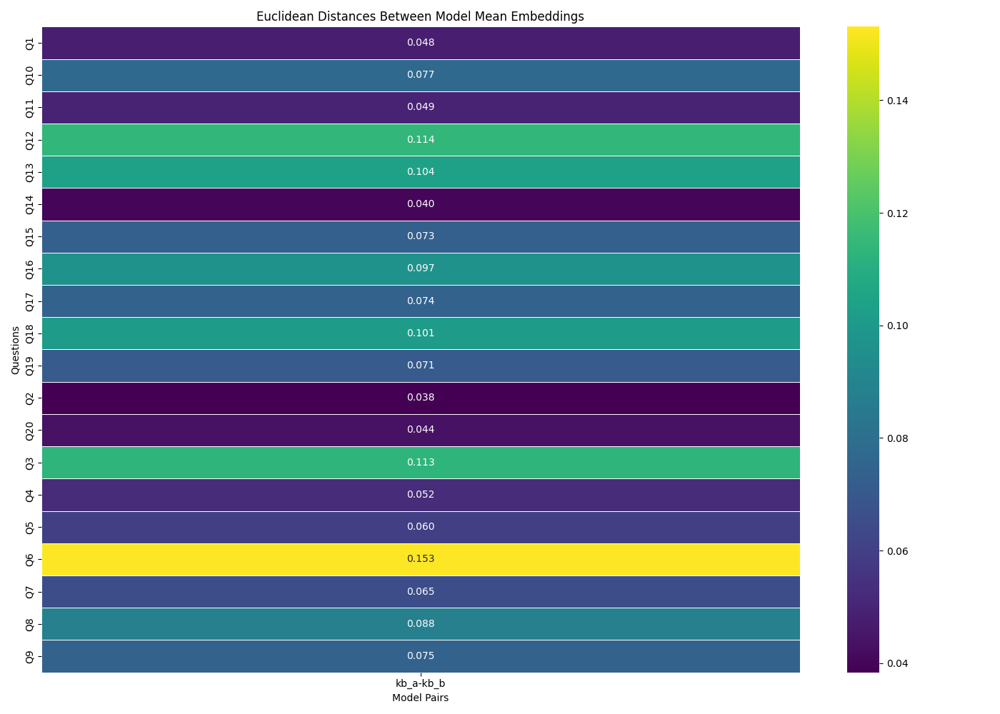
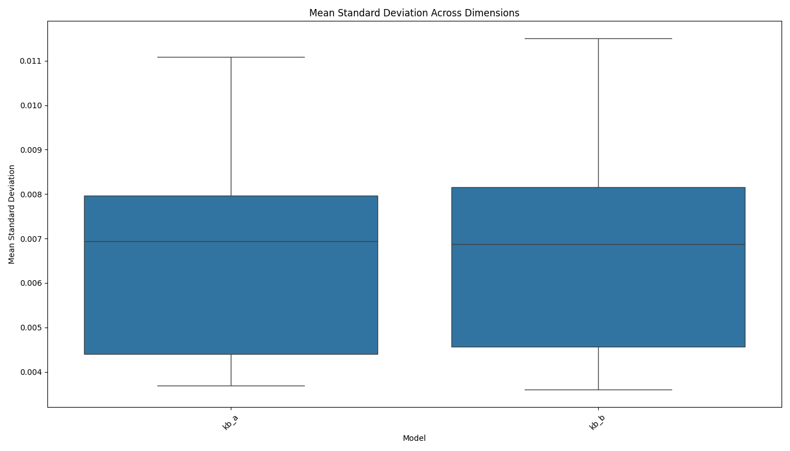
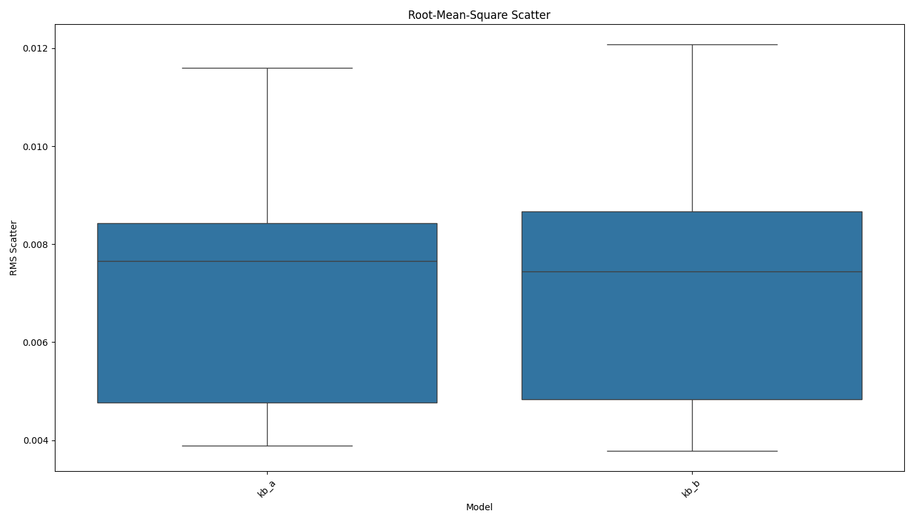

# AI Model Consistency Experiment Report

Analysis generated on: 2025-04-09 22:00:41

## Experiment Overview

- Models tested: kb_a, kb_b
- Number of questions: 20
- Results file: ./results/raw_results_20250409_220040.pkl

## Model Pair Distances

Average Euclidean distances between model mean embeddings across all questions:

| model1   | model2   |   distance |
|:---------|:---------|-----------:|
| kb_a     | kb_b     |     0.0768 |

## Consistency Metrics

### Mean Standard Deviation

Average of standard deviations across all embedding dimensions:

| model   |   mean_stddev |
|:--------|--------------:|
| kb_a    |        0.0065 |
| kb_b    |        0.0066 |

### Root-Mean-Square Scatter

Root-mean-square of standard deviations across all embedding dimensions:

| model   |   rms_scatter |
|:--------|--------------:|
| kb_a    |        0.0070 |
| kb_b    |        0.0072 |

## Visualizations

### Distance Matrix

### Mean Standard Deviation

### Root-Mean-Square Scatter

## Per-Question Analysis

### Q1

#### Model Distances

| question   | model1   | model2   |   distance |
|:-----------|:---------|:---------|-----------:|
| Q1         | kb_a     | kb_b     |     0.0481 |

#### Consistency Metrics

| model   | question   |   mean_stddev |   rms_scatter |   zero_std_dims | identical_responses   |
|:--------|:-----------|--------------:|--------------:|----------------:|:----------------------|
| kb_a    | Q1         |        0.0037 |        0.0039 |               0 | False                 |
| kb_b    | Q1         |        0.0036 |        0.0038 |               0 | False                 |

### Q2

#### Model Distances

| question   | model1   | model2   |   distance |
|:-----------|:---------|:---------|-----------:|
| Q2         | kb_a     | kb_b     |     0.0384 |

#### Consistency Metrics

| model   | question   |   mean_stddev |   rms_scatter |   zero_std_dims | identical_responses   |
|:--------|:-----------|--------------:|--------------:|----------------:|:----------------------|
| kb_a    | Q2         |        0.0044 |        0.0047 |               0 | False                 |
| kb_b    | Q2         |        0.0041 |        0.0044 |               0 | False                 |

### Q3

#### Model Distances

| question   | model1   | model2   |   distance |
|:-----------|:---------|:---------|-----------:|
| Q3         | kb_a     | kb_b     |     0.1131 |

#### Consistency Metrics

| model   | question   |   mean_stddev |   rms_scatter |   zero_std_dims | identical_responses   |
|:--------|:-----------|--------------:|--------------:|----------------:|:----------------------|
| kb_a    | Q3         |        0.0079 |        0.0084 |               0 | False                 |
| kb_b    | Q3         |        0.0081 |        0.0085 |               0 | False                 |

### Q4

#### Model Distances

| question   | model1   | model2   |   distance |
|:-----------|:---------|:---------|-----------:|
| Q4         | kb_a     | kb_b     |     0.0524 |

#### Consistency Metrics

| model   | question   |   mean_stddev |   rms_scatter |   zero_std_dims | identical_responses   |
|:--------|:-----------|--------------:|--------------:|----------------:|:----------------------|
| kb_a    | Q4         |        0.0053 |        0.0057 |               0 | False                 |
| kb_b    | Q4         |        0.0046 |        0.0049 |               0 | False                 |

### Q5

#### Model Distances

| question   | model1   | model2   |   distance |
|:-----------|:---------|:---------|-----------:|
| Q5         | kb_a     | kb_b     |     0.0596 |

#### Consistency Metrics

| model   | question   |   mean_stddev |   rms_scatter |   zero_std_dims | identical_responses   |
|:--------|:-----------|--------------:|--------------:|----------------:|:----------------------|
| kb_a    | Q5         |        0.0075 |        0.0081 |               0 | False                 |
| kb_b    | Q5         |        0.0075 |        0.0082 |               0 | False                 |

### Q6

#### Model Distances

| question   | model1   | model2   |   distance |
|:-----------|:---------|:---------|-----------:|
| Q6         | kb_a     | kb_b     |     0.1531 |

#### Consistency Metrics

| model   | question   |   mean_stddev |   rms_scatter |   zero_std_dims | identical_responses   |
|:--------|:-----------|--------------:|--------------:|----------------:|:----------------------|
| kb_a    | Q6         |        0.0111 |        0.0116 |               0 | False                 |
| kb_b    | Q6         |        0.0115 |        0.0121 |               0 | False                 |

### Q7

#### Model Distances

| question   | model1   | model2   |   distance |
|:-----------|:---------|:---------|-----------:|
| Q7         | kb_a     | kb_b     |     0.0651 |

#### Consistency Metrics

| model   | question   |   mean_stddev |   rms_scatter |   zero_std_dims | identical_responses   |
|:--------|:-----------|--------------:|--------------:|----------------:|:----------------------|
| kb_a    | Q7         |        0.0054 |        0.0056 |               0 | False                 |
| kb_b    | Q7         |        0.0055 |        0.0058 |               0 | False                 |

### Q8

#### Model Distances

| question   | model1   | model2   |   distance |
|:-----------|:---------|:---------|-----------:|
| Q8         | kb_a     | kb_b     |     0.0880 |

#### Consistency Metrics

| model   | question   |   mean_stddev |   rms_scatter |   zero_std_dims | identical_responses   |
|:--------|:-----------|--------------:|--------------:|----------------:|:----------------------|
| kb_a    | Q8         |        0.0070 |        0.0077 |               0 | False                 |
| kb_b    | Q8         |        0.0077 |        0.0085 |               0 | False                 |

### Q9

#### Model Distances

| question   | model1   | model2   |   distance |
|:-----------|:---------|:---------|-----------:|
| Q9         | kb_a     | kb_b     |     0.0746 |

#### Consistency Metrics

| model   | question   |   mean_stddev |   rms_scatter |   zero_std_dims | identical_responses   |
|:--------|:-----------|--------------:|--------------:|----------------:|:----------------------|
| kb_a    | Q9         |        0.0081 |        0.0087 |               0 | False                 |
| kb_b    | Q9         |        0.0084 |        0.0090 |               0 | False                 |

### Q10

#### Model Distances

| question   | model1   | model2   |   distance |
|:-----------|:---------|:---------|-----------:|
| Q10        | kb_a     | kb_b     |     0.0773 |

#### Consistency Metrics

| model   | question   |   mean_stddev |   rms_scatter |   zero_std_dims | identical_responses   |
|:--------|:-----------|--------------:|--------------:|----------------:|:----------------------|
| kb_a    | Q10        |        0.0087 |        0.0092 |               0 | False                 |
| kb_b    | Q10        |        0.0086 |        0.0092 |               0 | False                 |

### Q11

#### Model Distances

| question   | model1   | model2   |   distance |
|:-----------|:---------|:---------|-----------:|
| Q11        | kb_a     | kb_b     |     0.0492 |

#### Consistency Metrics

| model   | question   |   mean_stddev |   rms_scatter |   zero_std_dims | identical_responses   |
|:--------|:-----------|--------------:|--------------:|----------------:|:----------------------|
| kb_a    | Q11        |        0.0046 |        0.0049 |               0 | False                 |
| kb_b    | Q11        |        0.0045 |        0.0048 |               0 | False                 |

### Q12

#### Model Distances

| question   | model1   | model2   |   distance |
|:-----------|:---------|:---------|-----------:|
| Q12        | kb_a     | kb_b     |     0.1140 |

#### Consistency Metrics

| model   | question   |   mean_stddev |   rms_scatter |   zero_std_dims | identical_responses   |
|:--------|:-----------|--------------:|--------------:|----------------:|:----------------------|
| kb_a    | Q12        |        0.0072 |        0.0076 |               0 | False                 |
| kb_b    | Q12        |        0.0080 |        0.0085 |               0 | False                 |

### Q13

#### Model Distances

| question   | model1   | model2   |   distance |
|:-----------|:---------|:---------|-----------:|
| Q13        | kb_a     | kb_b     |     0.1037 |

#### Consistency Metrics

| model   | question   |   mean_stddev |   rms_scatter |   zero_std_dims | identical_responses   |
|:--------|:-----------|--------------:|--------------:|----------------:|:----------------------|
| kb_a    | Q13        |        0.0079 |        0.0082 |               0 | False                 |
| kb_b    | Q13        |        0.0077 |        0.0081 |               0 | False                 |

### Q14

#### Model Distances

| question   | model1   | model2   |   distance |
|:-----------|:---------|:---------|-----------:|
| Q14        | kb_a     | kb_b     |     0.0398 |

#### Consistency Metrics

| model   | question   |   mean_stddev |   rms_scatter |   zero_std_dims | identical_responses   |
|:--------|:-----------|--------------:|--------------:|----------------:|:----------------------|
| kb_a    | Q14        |        0.0038 |        0.0040 |               0 | False                 |
| kb_b    | Q14        |        0.0038 |        0.0040 |               0 | False                 |

### Q15

#### Model Distances

| question   | model1   | model2   |   distance |
|:-----------|:---------|:---------|-----------:|
| Q15        | kb_a     | kb_b     |     0.0733 |

#### Consistency Metrics

| model   | question   |   mean_stddev |   rms_scatter |   zero_std_dims | identical_responses   |
|:--------|:-----------|--------------:|--------------:|----------------:|:----------------------|
| kb_a    | Q15        |        0.0039 |        0.0048 |               0 | False                 |
| kb_b    | Q15        |        0.0049 |        0.0064 |               0 | False                 |

### Q16

#### Model Distances

| question   | model1   | model2   |   distance |
|:-----------|:---------|:---------|-----------:|
| Q16        | kb_a     | kb_b     |     0.0966 |

#### Consistency Metrics

| model   | question   |   mean_stddev |   rms_scatter |   zero_std_dims | identical_responses   |
|:--------|:-----------|--------------:|--------------:|----------------:|:----------------------|
| kb_a    | Q16        |        0.0044 |        0.0048 |               0 | False                 |
| kb_b    | Q16        |        0.0058 |        0.0063 |               0 | False                 |

### Q17

#### Model Distances

| question   | model1   | model2   |   distance |
|:-----------|:---------|:---------|-----------:|
| Q17        | kb_a     | kb_b     |     0.0742 |

#### Consistency Metrics

| model   | question   |   mean_stddev |   rms_scatter |   zero_std_dims | identical_responses   |
|:--------|:-----------|--------------:|--------------:|----------------:|:----------------------|
| kb_a    | Q17        |        0.0092 |        0.0107 |               0 | False                 |
| kb_b    | Q17        |        0.0084 |        0.0096 |               0 | False                 |

### Q18

#### Model Distances

| question   | model1   | model2   |   distance |
|:-----------|:---------|:---------|-----------:|
| Q18        | kb_a     | kb_b     |     0.1014 |

#### Consistency Metrics

| model   | question   |   mean_stddev |   rms_scatter |   zero_std_dims | identical_responses   |
|:--------|:-----------|--------------:|--------------:|----------------:|:----------------------|
| kb_a    | Q18        |        0.0094 |        0.0101 |               0 | False                 |
| kb_b    | Q18        |        0.0091 |        0.0097 |               0 | False                 |

### Q19

#### Model Distances

| question   | model1   | model2   |   distance |
|:-----------|:---------|:---------|-----------:|
| Q19        | kb_a     | kb_b     |     0.0708 |

#### Consistency Metrics

| model   | question   |   mean_stddev |   rms_scatter |   zero_std_dims | identical_responses   |
|:--------|:-----------|--------------:|--------------:|----------------:|:----------------------|
| kb_a    | Q19        |        0.0040 |        0.0047 |               0 | False                 |
| kb_b    | Q19        |        0.0040 |        0.0048 |               0 | False                 |

### Q20

#### Model Distances

| question   | model1   | model2   |   distance |
|:-----------|:---------|:---------|-----------:|
| Q20        | kb_a     | kb_b     |     0.0436 |

#### Consistency Metrics

| model   | question   |   mean_stddev |   rms_scatter |   zero_std_dims | identical_responses   |
|:--------|:-----------|--------------:|--------------:|----------------:|:----------------------|
| kb_a    | Q20        |        0.0068 |        0.0077 |               0 | False                 |
| kb_b    | Q20        |        0.0062 |        0.0068 |               0 | False                 |

