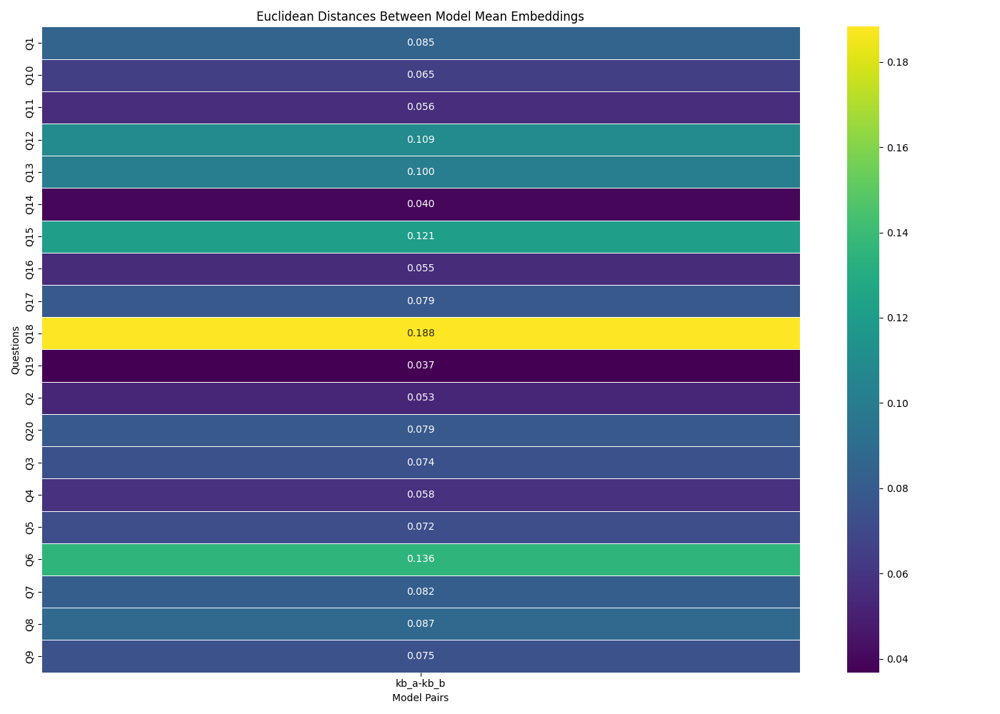
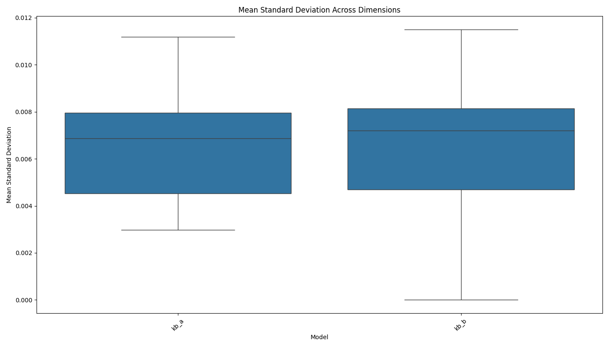
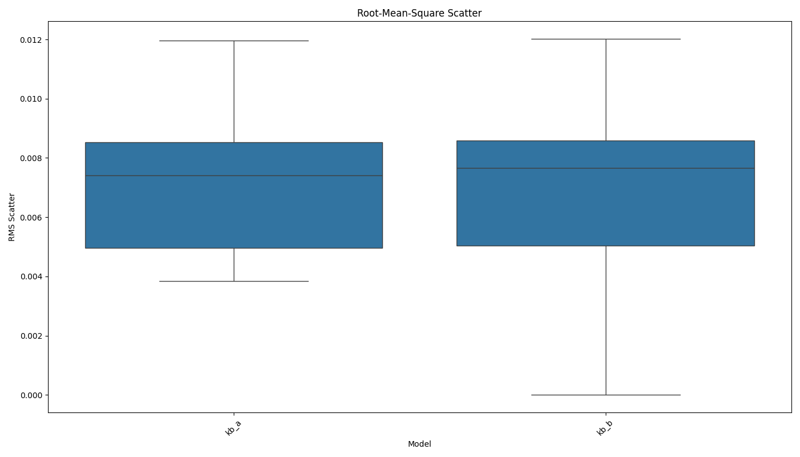

# AI Model Consistency Experiment Report

Analysis generated on: 2025-04-10 01:08:00

## Experiment Overview

- Models tested: kb_a, kb_b
- Number of questions: 20
- Results file: ./results/raw_results_20250410_010759.pkl

## Model Pair Distances

Average Euclidean distances between model mean embeddings across all questions:

| model1   | model2   |   distance |
|:---------|:---------|-----------:|
| kb_a     | kb_b     |     0.0826 |

## Consistency Metrics

### Mean Standard Deviation

Average of standard deviations across all embedding dimensions:

| model   |   mean_stddev |
|:--------|--------------:|
| kb_a    |        0.0067 |
| kb_b    |        0.0067 |

### Root-Mean-Square Scatter

Root-mean-square of standard deviations across all embedding dimensions:

| model   |   rms_scatter |
|:--------|--------------:|
| kb_a    |        0.0073 |
| kb_b    |        0.0072 |

## Visualizations

### Distance Matrix

### Mean Standard Deviation

### Root-Mean-Square Scatter

## Per-Question Analysis

### Q1

#### Model Distances

| question   | model1   | model2   |   distance |
|:-----------|:---------|:---------|-----------:|
| Q1         | kb_a     | kb_b     |     0.0851 |

#### Consistency Metrics

| model   | question   |   mean_stddev |   rms_scatter |   zero_std_dims | identical_responses   |
|:--------|:-----------|--------------:|--------------:|----------------:|:----------------------|
| kb_a    | Q1         |        0.0074 |        0.0079 |               0 | False                 |
| kb_b    | Q1         |        0.0073 |        0.0079 |               0 | False                 |

### Q2

#### Model Distances

| question   | model1   | model2   |   distance |
|:-----------|:---------|:---------|-----------:|
| Q2         | kb_a     | kb_b     |     0.0529 |

#### Consistency Metrics

| model   | question   |   mean_stddev |   rms_scatter |   zero_std_dims | identical_responses   |
|:--------|:-----------|--------------:|--------------:|----------------:|:----------------------|
| kb_a    | Q2         |        0.0044 |        0.0046 |               0 | False                 |
| kb_b    | Q2         |        0.0048 |        0.0050 |               0 | False                 |

### Q3

#### Model Distances

| question   | model1   | model2   |   distance |
|:-----------|:---------|:---------|-----------:|
| Q3         | kb_a     | kb_b     |     0.0742 |

#### Consistency Metrics

| model   | question   |   mean_stddev |   rms_scatter |   zero_std_dims | identical_responses   |
|:--------|:-----------|--------------:|--------------:|----------------:|:----------------------|
| kb_a    | Q3         |        0.0061 |        0.0063 |               0 | False                 |
| kb_b    | Q3         |        0.0064 |        0.0067 |               0 | False                 |

### Q4

#### Model Distances

| question   | model1   | model2   |   distance |
|:-----------|:---------|:---------|-----------:|
| Q4         | kb_a     | kb_b     |     0.0582 |

#### Consistency Metrics

| model   | question   |   mean_stddev |   rms_scatter |   zero_std_dims | identical_responses   |
|:--------|:-----------|--------------:|--------------:|----------------:|:----------------------|
| kb_a    | Q4         |        0.0064 |        0.0067 |               0 | False                 |
| kb_b    | Q4         |        0.0063 |        0.0066 |               0 | False                 |

### Q5

#### Model Distances

| question   | model1   | model2   |   distance |
|:-----------|:---------|:---------|-----------:|
| Q5         | kb_a     | kb_b     |     0.0724 |

#### Consistency Metrics

| model   | question   |   mean_stddev |   rms_scatter |   zero_std_dims | identical_responses   |
|:--------|:-----------|--------------:|--------------:|----------------:|:----------------------|
| kb_a    | Q5         |        0.0079 |        0.0084 |               0 | False                 |
| kb_b    | Q5         |        0.0083 |        0.0089 |               0 | False                 |

### Q6

#### Model Distances

| question   | model1   | model2   |   distance |
|:-----------|:---------|:---------|-----------:|
| Q6         | kb_a     | kb_b     |     0.1355 |

#### Consistency Metrics

| model   | question   |   mean_stddev |   rms_scatter |   zero_std_dims | identical_responses   |
|:--------|:-----------|--------------:|--------------:|----------------:|:----------------------|
| kb_a    | Q6         |        0.0112 |        0.0117 |               0 | False                 |
| kb_b    | Q6         |        0.0115 |        0.0120 |               0 | False                 |

### Q7

#### Model Distances

| question   | model1   | model2   |   distance |
|:-----------|:---------|:---------|-----------:|
| Q7         | kb_a     | kb_b     |     0.0817 |

#### Consistency Metrics

| model   | question   |   mean_stddev |   rms_scatter |   zero_std_dims | identical_responses   |
|:--------|:-----------|--------------:|--------------:|----------------:|:----------------------|
| kb_a    | Q7         |        0.0072 |        0.0080 |               0 | False                 |
| kb_b    | Q7         |        0.0073 |        0.0081 |               0 | False                 |

### Q8

#### Model Distances

| question   | model1   | model2   |   distance |
|:-----------|:---------|:---------|-----------:|
| Q8         | kb_a     | kb_b     |     0.0873 |

#### Consistency Metrics

| model   | question   |   mean_stddev |   rms_scatter |   zero_std_dims | identical_responses   |
|:--------|:-----------|--------------:|--------------:|----------------:|:----------------------|
| kb_a    | Q8         |        0.0079 |        0.0083 |               0 | False                 |
| kb_b    | Q8         |        0.0081 |        0.0085 |               0 | False                 |

### Q9

#### Model Distances

| question   | model1   | model2   |   distance |
|:-----------|:---------|:---------|-----------:|
| Q9         | kb_a     | kb_b     |     0.0753 |

#### Consistency Metrics

| model   | question   |   mean_stddev |   rms_scatter |   zero_std_dims | identical_responses   |
|:--------|:-----------|--------------:|--------------:|----------------:|:----------------------|
| kb_a    | Q9         |        0.0082 |        0.0088 |               0 | False                 |
| kb_b    | Q9         |        0.0080 |        0.0084 |               0 | False                 |

### Q10

#### Model Distances

| question   | model1   | model2   |   distance |
|:-----------|:---------|:---------|-----------:|
| Q10        | kb_a     | kb_b     |     0.0650 |

#### Consistency Metrics

| model   | question   |   mean_stddev |   rms_scatter |   zero_std_dims | identical_responses   |
|:--------|:-----------|--------------:|--------------:|----------------:|:----------------------|
| kb_a    | Q10        |        0.0066 |        0.0069 |               0 | False                 |
| kb_b    | Q10        |        0.0071 |        0.0075 |               0 | False                 |

### Q11

#### Model Distances

| question   | model1   | model2   |   distance |
|:-----------|:---------|:---------|-----------:|
| Q11        | kb_a     | kb_b     |     0.0561 |

#### Consistency Metrics

| model   | question   |   mean_stddev |   rms_scatter |   zero_std_dims | identical_responses   |
|:--------|:-----------|--------------:|--------------:|----------------:|:----------------------|
| kb_a    | Q11        |        0.0040 |        0.0043 |               0 | False                 |
| kb_b    | Q11        |        0.0042 |        0.0045 |               0 | False                 |

### Q12

#### Model Distances

| question   | model1   | model2   |   distance |
|:-----------|:---------|:---------|-----------:|
| Q12        | kb_a     | kb_b     |     0.1089 |

#### Consistency Metrics

| model   | question   |   mean_stddev |   rms_scatter |   zero_std_dims | identical_responses   |
|:--------|:-----------|--------------:|--------------:|----------------:|:----------------------|
| kb_a    | Q12        |        0.0083 |        0.0090 |               0 | False                 |
| kb_b    | Q12        |        0.0084 |        0.0090 |               0 | False                 |

### Q13

#### Model Distances

| question   | model1   | model2   |   distance |
|:-----------|:---------|:---------|-----------:|
| Q13        | kb_a     | kb_b     |     0.1004 |

#### Consistency Metrics

| model   | question   |   mean_stddev |   rms_scatter |   zero_std_dims | identical_responses   |
|:--------|:-----------|--------------:|--------------:|----------------:|:----------------------|
| kb_a    | Q13        |        0.0079 |        0.0083 |               0 | False                 |
| kb_b    | Q13        |        0.0075 |        0.0078 |               0 | False                 |

### Q14

#### Model Distances

| question   | model1   | model2   |   distance |
|:-----------|:---------|:---------|-----------:|
| Q14        | kb_a     | kb_b     |     0.0395 |

#### Consistency Metrics

| model   | question   |   mean_stddev |   rms_scatter |   zero_std_dims | identical_responses   |
|:--------|:-----------|--------------:|--------------:|----------------:|:----------------------|
| kb_a    | Q14        |        0.0038 |        0.0040 |               0 | False                 |
| kb_b    | Q14        |        0.0037 |        0.0039 |               0 | False                 |

### Q15

#### Model Distances

| question   | model1   | model2   |   distance |
|:-----------|:---------|:---------|-----------:|
| Q15        | kb_a     | kb_b     |     0.1213 |

#### Consistency Metrics

| model   | question   |   mean_stddev |   rms_scatter |   zero_std_dims | identical_responses   |
|:--------|:-----------|--------------:|--------------:|----------------:|:----------------------|
| kb_a    | Q15        |        0.0055 |        0.0066 |               0 | False                 |
| kb_b    | Q15        |        0.0000 |        0.0000 |             267 | True                  |

### Q16

#### Model Distances

| question   | model1   | model2   |   distance |
|:-----------|:---------|:---------|-----------:|
| Q16        | kb_a     | kb_b     |     0.0553 |

#### Consistency Metrics

| model   | question   |   mean_stddev |   rms_scatter |   zero_std_dims | identical_responses   |
|:--------|:-----------|--------------:|--------------:|----------------:|:----------------------|
| kb_a    | Q16        |        0.0041 |        0.0046 |               0 | False                 |
| kb_b    | Q16        |        0.0045 |        0.0050 |               0 | False                 |

### Q17

#### Model Distances

| question   | model1   | model2   |   distance |
|:-----------|:---------|:---------|-----------:|
| Q17        | kb_a     | kb_b     |     0.0787 |

#### Consistency Metrics

| model   | question   |   mean_stddev |   rms_scatter |   zero_std_dims | identical_responses   |
|:--------|:-----------|--------------:|--------------:|----------------:|:----------------------|
| kb_a    | Q17        |        0.0103 |        0.0120 |               0 | False                 |
| kb_b    | Q17        |        0.0097 |        0.0113 |               0 | False                 |

### Q18

#### Model Distances

| question   | model1   | model2   |   distance |
|:-----------|:---------|:---------|-----------:|
| Q18        | kb_a     | kb_b     |     0.1883 |

#### Consistency Metrics

| model   | question   |   mean_stddev |   rms_scatter |   zero_std_dims | identical_responses   |
|:--------|:-----------|--------------:|--------------:|----------------:|:----------------------|
| kb_a    | Q18        |        0.0093 |        0.0099 |               0 | False                 |
| kb_b    | Q18        |        0.0098 |        0.0104 |               0 | False                 |

### Q19

#### Model Distances

| question   | model1   | model2   |   distance |
|:-----------|:---------|:---------|-----------:|
| Q19        | kb_a     | kb_b     |     0.0368 |

#### Consistency Metrics

| model   | question   |   mean_stddev |   rms_scatter |   zero_std_dims | identical_responses   |
|:--------|:-----------|--------------:|--------------:|----------------:|:----------------------|
| kb_a    | Q19        |        0.0030 |        0.0039 |               0 | False                 |
| kb_b    | Q19        |        0.0041 |        0.0049 |               0 | False                 |

### Q20

#### Model Distances

| question   | model1   | model2   |   distance |
|:-----------|:---------|:---------|-----------:|
| Q20        | kb_a     | kb_b     |     0.0787 |

#### Consistency Metrics

| model   | question   |   mean_stddev |   rms_scatter |   zero_std_dims | identical_responses   |
|:--------|:-----------|--------------:|--------------:|----------------:|:----------------------|
| kb_a    | Q20        |        0.0046 |        0.0051 |               0 | False                 |
| kb_b    | Q20        |        0.0062 |        0.0068 |               0 | False                 |

