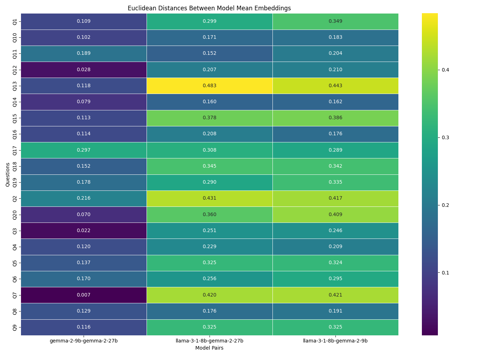
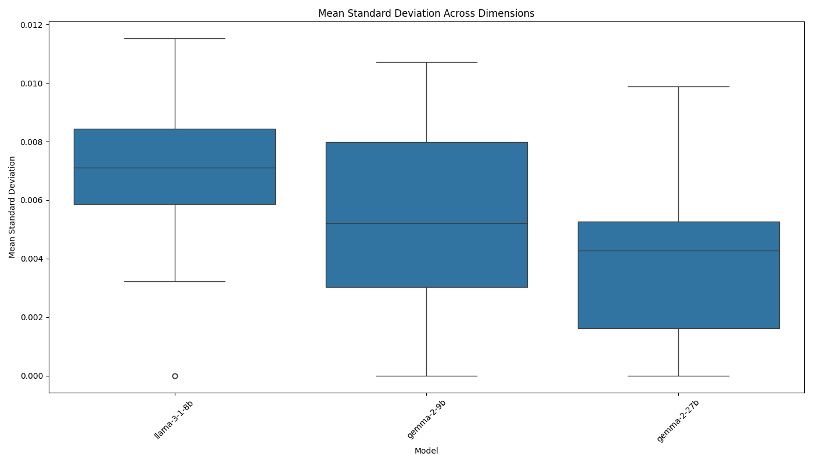
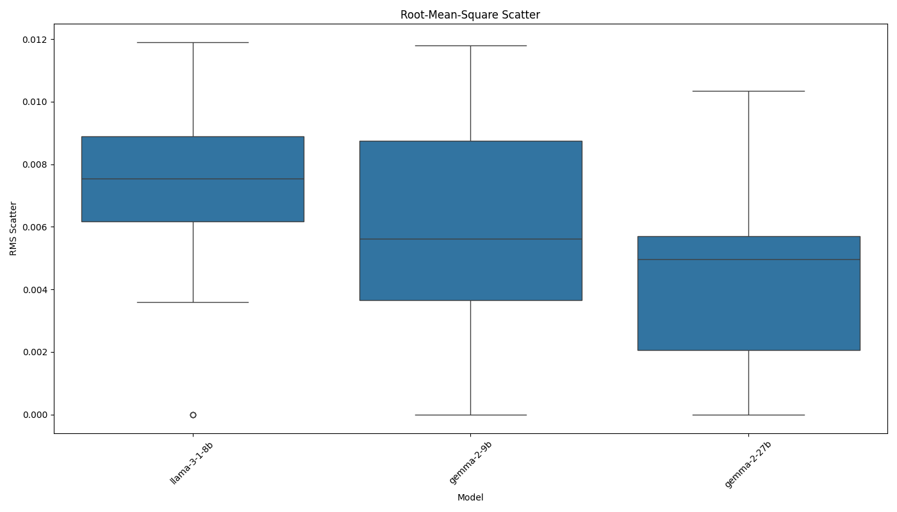

# AI Model Consistency Experiment Report

Analysis generated on: 2025-03-20 01:36:08

## Experiment Overview

- Models tested: llama-3-1-8b, gemma-2-9b, gemma-2-27b
- Number of questions: 20
- Results file: ./results/raw_results_20250320_013607.pkl

## Model Pair Distances

Average Euclidean distances between model mean embeddings across all questions:

| model1       | model2      |   distance |
|:-------------|:------------|-----------:|
| gemma-2-9b   | gemma-2-27b |     0.1233 |
| llama-3-1-8b | gemma-2-27b |     0.2886 |
| llama-3-1-8b | gemma-2-9b  |     0.2958 |

## Consistency Metrics

### Mean Standard Deviation

Average of standard deviations across all embedding dimensions:

| model        |   mean_stddev |
|:-------------|--------------:|
| gemma-2-27b  |        0.0038 |
| gemma-2-9b   |        0.0053 |
| llama-3-1-8b |        0.0065 |

### Root-Mean-Square Scatter

Root-mean-square of standard deviations across all embedding dimensions:

| model        |   rms_scatter |
|:-------------|--------------:|
| gemma-2-27b  |        0.0042 |
| gemma-2-9b   |        0.0058 |
| llama-3-1-8b |        0.0069 |

## Visualizations

### Distance Matrix

### Mean Standard Deviation

### Root-Mean-Square Scatter

## Per-Question Analysis

### Q1

#### Model Distances

| question   | model1       | model2      |   distance |
|:-----------|:-------------|:------------|-----------:|
| Q1         | llama-3-1-8b | gemma-2-9b  |     0.3485 |
| Q1         | llama-3-1-8b | gemma-2-27b |     0.2990 |
| Q1         | gemma-2-9b   | gemma-2-27b |     0.1089 |

#### Consistency Metrics

| model        | question   |   mean_stddev |   rms_scatter |   zero_std_dims | identical_responses   |
|:-------------|:-----------|--------------:|--------------:|----------------:|:----------------------|
| llama-3-1-8b | Q1         |        0.0096 |        0.0100 |               0 | False                 |
| gemma-2-9b   | Q1         |        0.0028 |        0.0030 |               0 | False                 |
| gemma-2-27b  | Q1         |        0.0044 |        0.0048 |               0 | False                 |

### Q2

#### Model Distances

| question   | model1       | model2      |   distance |
|:-----------|:-------------|:------------|-----------:|
| Q2         | llama-3-1-8b | gemma-2-9b  |     0.4168 |
| Q2         | llama-3-1-8b | gemma-2-27b |     0.4311 |
| Q2         | gemma-2-9b   | gemma-2-27b |     0.2159 |

#### Consistency Metrics

| model        | question   |   mean_stddev |   rms_scatter |   zero_std_dims | identical_responses   |
|:-------------|:-----------|--------------:|--------------:|----------------:|:----------------------|
| llama-3-1-8b | Q2         |        0.0114 |        0.0118 |               0 | False                 |
| gemma-2-9b   | Q2         |        0.0104 |        0.0118 |               0 | False                 |
| gemma-2-27b  | Q2         |        0.0051 |        0.0058 |               0 | False                 |

### Q3

#### Model Distances

| question   | model1       | model2      |   distance |
|:-----------|:-------------|:------------|-----------:|
| Q3         | llama-3-1-8b | gemma-2-9b  |     0.2463 |
| Q3         | llama-3-1-8b | gemma-2-27b |     0.2506 |
| Q3         | gemma-2-9b   | gemma-2-27b |     0.0216 |

#### Consistency Metrics

| model        | question   |   mean_stddev |   rms_scatter |   zero_std_dims | identical_responses   |
|:-------------|:-----------|--------------:|--------------:|----------------:|:----------------------|
| llama-3-1-8b | Q3         |        0.0000 |        0.0000 |             136 | True                  |
| gemma-2-9b   | Q3         |        0.0031 |        0.0039 |               0 | False                 |
| gemma-2-27b  | Q3         |        0.0009 |        0.0012 |               0 | False                 |

### Q4

#### Model Distances

| question   | model1       | model2      |   distance |
|:-----------|:-------------|:------------|-----------:|
| Q4         | llama-3-1-8b | gemma-2-9b  |     0.2094 |
| Q4         | llama-3-1-8b | gemma-2-27b |     0.2288 |
| Q4         | gemma-2-9b   | gemma-2-27b |     0.1196 |

#### Consistency Metrics

| model        | question   |   mean_stddev |   rms_scatter |   zero_std_dims | identical_responses   |
|:-------------|:-----------|--------------:|--------------:|----------------:|:----------------------|
| llama-3-1-8b | Q4         |        0.0063 |        0.0068 |               0 | False                 |
| gemma-2-9b   | Q4         |        0.0037 |        0.0040 |               0 | False                 |
| gemma-2-27b  | Q4         |        0.0052 |        0.0057 |               0 | False                 |

### Q5

#### Model Distances

| question   | model1       | model2      |   distance |
|:-----------|:-------------|:------------|-----------:|
| Q5         | llama-3-1-8b | gemma-2-9b  |     0.3243 |
| Q5         | llama-3-1-8b | gemma-2-27b |     0.3245 |
| Q5         | gemma-2-9b   | gemma-2-27b |     0.1374 |

#### Consistency Metrics

| model        | question   |   mean_stddev |   rms_scatter |   zero_std_dims | identical_responses   |
|:-------------|:-----------|--------------:|--------------:|----------------:|:----------------------|
| llama-3-1-8b | Q5         |        0.0096 |        0.0101 |               0 | False                 |
| gemma-2-9b   | Q5         |        0.0100 |        0.0110 |               0 | False                 |
| gemma-2-27b  | Q5         |        0.0041 |        0.0050 |               0 | False                 |

### Q6

#### Model Distances

| question   | model1       | model2      |   distance |
|:-----------|:-------------|:------------|-----------:|
| Q6         | llama-3-1-8b | gemma-2-9b  |     0.2946 |
| Q6         | llama-3-1-8b | gemma-2-27b |     0.2555 |
| Q6         | gemma-2-9b   | gemma-2-27b |     0.1702 |

#### Consistency Metrics

| model        | question   |   mean_stddev |   rms_scatter |   zero_std_dims | identical_responses   |
|:-------------|:-----------|--------------:|--------------:|----------------:|:----------------------|
| llama-3-1-8b | Q6         |        0.0075 |        0.0082 |               0 | False                 |
| gemma-2-9b   | Q6         |        0.0107 |        0.0117 |               0 | False                 |
| gemma-2-27b  | Q6         |        0.0043 |        0.0050 |               0 | False                 |

### Q7

#### Model Distances

| question   | model1       | model2      |   distance |
|:-----------|:-------------|:------------|-----------:|
| Q7         | llama-3-1-8b | gemma-2-9b  |     0.4211 |
| Q7         | llama-3-1-8b | gemma-2-27b |     0.4195 |
| Q7         | gemma-2-9b   | gemma-2-27b |     0.0072 |

#### Consistency Metrics

| model        | question   |   mean_stddev |   rms_scatter |   zero_std_dims | identical_responses   |
|:-------------|:-----------|--------------:|--------------:|----------------:|:----------------------|
| llama-3-1-8b | Q7         |        0.0081 |        0.0083 |               0 | False                 |
| gemma-2-9b   | Q7         |        0.0000 |        0.0000 |             137 | True                  |
| gemma-2-27b  | Q7         |        0.0010 |        0.0013 |               0 | False                 |

### Q8

#### Model Distances

| question   | model1       | model2      |   distance |
|:-----------|:-------------|:------------|-----------:|
| Q8         | llama-3-1-8b | gemma-2-9b  |     0.1914 |
| Q8         | llama-3-1-8b | gemma-2-27b |     0.1765 |
| Q8         | gemma-2-9b   | gemma-2-27b |     0.1289 |

#### Consistency Metrics

| model        | question   |   mean_stddev |   rms_scatter |   zero_std_dims | identical_responses   |
|:-------------|:-----------|--------------:|--------------:|----------------:|:----------------------|
| llama-3-1-8b | Q8         |        0.0073 |        0.0079 |               0 | False                 |
| gemma-2-9b   | Q8         |        0.0047 |        0.0050 |               0 | False                 |
| gemma-2-27b  | Q8         |        0.0056 |        0.0059 |               0 | False                 |

### Q9

#### Model Distances

| question   | model1       | model2      |   distance |
|:-----------|:-------------|:------------|-----------:|
| Q9         | llama-3-1-8b | gemma-2-9b  |     0.3245 |
| Q9         | llama-3-1-8b | gemma-2-27b |     0.3255 |
| Q9         | gemma-2-9b   | gemma-2-27b |     0.1157 |

#### Consistency Metrics

| model        | question   |   mean_stddev |   rms_scatter |   zero_std_dims | identical_responses   |
|:-------------|:-----------|--------------:|--------------:|----------------:|:----------------------|
| llama-3-1-8b | Q9         |        0.0084 |        0.0088 |               0 | False                 |
| gemma-2-9b   | Q9         |        0.0060 |        0.0064 |               0 | False                 |
| gemma-2-27b  | Q9         |        0.0049 |        0.0055 |               0 | False                 |

### Q10

#### Model Distances

| question   | model1       | model2      |   distance |
|:-----------|:-------------|:------------|-----------:|
| Q10        | llama-3-1-8b | gemma-2-9b  |     0.1828 |
| Q10        | llama-3-1-8b | gemma-2-27b |     0.1705 |
| Q10        | gemma-2-9b   | gemma-2-27b |     0.1021 |

#### Consistency Metrics

| model        | question   |   mean_stddev |   rms_scatter |   zero_std_dims | identical_responses   |
|:-------------|:-----------|--------------:|--------------:|----------------:|:----------------------|
| llama-3-1-8b | Q10        |        0.0032 |        0.0036 |               0 | False                 |
| gemma-2-9b   | Q10        |        0.0000 |        0.0000 |             149 | True                  |
| gemma-2-27b  | Q10        |        0.0021 |        0.0025 |               0 | False                 |

### Q11

#### Model Distances

| question   | model1       | model2      |   distance |
|:-----------|:-------------|:------------|-----------:|
| Q11        | llama-3-1-8b | gemma-2-9b  |     0.2041 |
| Q11        | llama-3-1-8b | gemma-2-27b |     0.1525 |
| Q11        | gemma-2-9b   | gemma-2-27b |     0.1893 |

#### Consistency Metrics

| model        | question   |   mean_stddev |   rms_scatter |   zero_std_dims | identical_responses   |
|:-------------|:-----------|--------------:|--------------:|----------------:|:----------------------|
| llama-3-1-8b | Q11        |        0.0076 |        0.0078 |               0 | False                 |
| gemma-2-9b   | Q11        |        0.0042 |        0.0045 |               0 | False                 |
| gemma-2-27b  | Q11        |        0.0032 |        0.0034 |               0 | False                 |

### Q12

#### Model Distances

| question   | model1       | model2      |   distance |
|:-----------|:-------------|:------------|-----------:|
| Q12        | llama-3-1-8b | gemma-2-9b  |     0.2104 |
| Q12        | llama-3-1-8b | gemma-2-27b |     0.2066 |
| Q12        | gemma-2-9b   | gemma-2-27b |     0.0281 |

#### Consistency Metrics

| model        | question   |   mean_stddev |   rms_scatter |   zero_std_dims | identical_responses   |
|:-------------|:-----------|--------------:|--------------:|----------------:|:----------------------|
| llama-3-1-8b | Q12        |        0.0000 |        0.0000 |             154 | True                  |
| gemma-2-9b   | Q12        |        0.0018 |        0.0023 |               0 | False                 |
| gemma-2-27b  | Q12        |        0.0000 |        0.0000 |             156 | True                  |

### Q13

#### Model Distances

| question   | model1       | model2      |   distance |
|:-----------|:-------------|:------------|-----------:|
| Q13        | llama-3-1-8b | gemma-2-9b  |     0.4429 |
| Q13        | llama-3-1-8b | gemma-2-27b |     0.4834 |
| Q13        | gemma-2-9b   | gemma-2-27b |     0.1180 |

#### Consistency Metrics

| model        | question   |   mean_stddev |   rms_scatter |   zero_std_dims | identical_responses   |
|:-------------|:-----------|--------------:|--------------:|----------------:|:----------------------|
| llama-3-1-8b | Q13        |        0.0115 |        0.0119 |               0 | False                 |
| gemma-2-9b   | Q13        |        0.0082 |        0.0089 |               0 | False                 |
| gemma-2-27b  | Q13        |        0.0018 |        0.0023 |               0 | False                 |

### Q14

#### Model Distances

| question   | model1       | model2      |   distance |
|:-----------|:-------------|:------------|-----------:|
| Q14        | llama-3-1-8b | gemma-2-9b  |     0.1625 |
| Q14        | llama-3-1-8b | gemma-2-27b |     0.1595 |
| Q14        | gemma-2-9b   | gemma-2-27b |     0.0786 |

#### Consistency Metrics

| model        | question   |   mean_stddev |   rms_scatter |   zero_std_dims | identical_responses   |
|:-------------|:-----------|--------------:|--------------:|----------------:|:----------------------|
| llama-3-1-8b | Q14        |        0.0000 |        0.0000 |             146 | True                  |
| gemma-2-9b   | Q14        |        0.0041 |        0.0051 |               0 | False                 |
| gemma-2-27b  | Q14        |        0.0000 |        0.0000 |             154 | True                  |

### Q15

#### Model Distances

| question   | model1       | model2      |   distance |
|:-----------|:-------------|:------------|-----------:|
| Q15        | llama-3-1-8b | gemma-2-9b  |     0.3856 |
| Q15        | llama-3-1-8b | gemma-2-27b |     0.3781 |
| Q15        | gemma-2-9b   | gemma-2-27b |     0.1131 |

#### Consistency Metrics

| model        | question   |   mean_stddev |   rms_scatter |   zero_std_dims | identical_responses   |
|:-------------|:-----------|--------------:|--------------:|----------------:|:----------------------|
| llama-3-1-8b | Q15        |        0.0069 |        0.0072 |               0 | False                 |
| gemma-2-9b   | Q15        |        0.0079 |        0.0087 |               0 | False                 |
| gemma-2-27b  | Q15        |        0.0099 |        0.0104 |               0 | False                 |

### Q16

#### Model Distances

| question   | model1       | model2      |   distance |
|:-----------|:-------------|:------------|-----------:|
| Q16        | llama-3-1-8b | gemma-2-9b  |     0.1756 |
| Q16        | llama-3-1-8b | gemma-2-27b |     0.2079 |
| Q16        | gemma-2-9b   | gemma-2-27b |     0.1140 |

#### Consistency Metrics

| model        | question   |   mean_stddev |   rms_scatter |   zero_std_dims | identical_responses   |
|:-------------|:-----------|--------------:|--------------:|----------------:|:----------------------|
| llama-3-1-8b | Q16        |        0.0068 |        0.0073 |               0 | False                 |
| gemma-2-9b   | Q16        |        0.0057 |        0.0061 |               0 | False                 |
| gemma-2-27b  | Q16        |        0.0054 |        0.0055 |               0 | False                 |

### Q17

#### Model Distances

| question   | model1       | model2      |   distance |
|:-----------|:-------------|:------------|-----------:|
| Q17        | llama-3-1-8b | gemma-2-9b  |     0.2894 |
| Q17        | llama-3-1-8b | gemma-2-27b |     0.3083 |
| Q17        | gemma-2-9b   | gemma-2-27b |     0.2975 |

#### Consistency Metrics

| model        | question   |   mean_stddev |   rms_scatter |   zero_std_dims | identical_responses   |
|:-------------|:-----------|--------------:|--------------:|----------------:|:----------------------|
| llama-3-1-8b | Q17        |        0.0063 |        0.0068 |               0 | False                 |
| gemma-2-9b   | Q17        |        0.0072 |        0.0076 |               0 | False                 |
| gemma-2-27b  | Q17        |        0.0000 |        0.0000 |             140 | True                  |

### Q18

#### Model Distances

| question   | model1       | model2      |   distance |
|:-----------|:-------------|:------------|-----------:|
| Q18        | llama-3-1-8b | gemma-2-9b  |     0.3417 |
| Q18        | llama-3-1-8b | gemma-2-27b |     0.3452 |
| Q18        | gemma-2-9b   | gemma-2-27b |     0.1523 |

#### Consistency Metrics

| model        | question   |   mean_stddev |   rms_scatter |   zero_std_dims | identical_responses   |
|:-------------|:-----------|--------------:|--------------:|----------------:|:----------------------|
| llama-3-1-8b | Q18        |        0.0059 |        0.0063 |               0 | False                 |
| gemma-2-9b   | Q18        |        0.0089 |        0.0094 |               0 | False                 |
| gemma-2-27b  | Q18        |        0.0085 |        0.0089 |               0 | False                 |

### Q19

#### Model Distances

| question   | model1       | model2      |   distance |
|:-----------|:-------------|:------------|-----------:|
| Q19        | llama-3-1-8b | gemma-2-9b  |     0.3348 |
| Q19        | llama-3-1-8b | gemma-2-27b |     0.2897 |
| Q19        | gemma-2-9b   | gemma-2-27b |     0.1775 |

#### Consistency Metrics

| model        | question   |   mean_stddev |   rms_scatter |   zero_std_dims | identical_responses   |
|:-------------|:-----------|--------------:|--------------:|----------------:|:----------------------|
| llama-3-1-8b | Q19        |        0.0085 |        0.0093 |               0 | False                 |
| gemma-2-9b   | Q19        |        0.0067 |        0.0072 |               0 | False                 |
| gemma-2-27b  | Q19        |        0.0064 |        0.0067 |               0 | False                 |

### Q20

#### Model Distances

| question   | model1       | model2      |   distance |
|:-----------|:-------------|:------------|-----------:|
| Q20        | llama-3-1-8b | gemma-2-9b  |     0.4085 |
| Q20        | llama-3-1-8b | gemma-2-27b |     0.3596 |
| Q20        | gemma-2-9b   | gemma-2-27b |     0.0695 |

#### Consistency Metrics

| model        | question   |   mean_stddev |   rms_scatter |   zero_std_dims | identical_responses   |
|:-------------|:-----------|--------------:|--------------:|----------------:|:----------------------|
| llama-3-1-8b | Q20        |        0.0056 |        0.0059 |               0 | False                 |
| gemma-2-9b   | Q20        |        0.0000 |        0.0000 |             147 | True                  |
| gemma-2-27b  | Q20        |        0.0043 |        0.0052 |               0 | False                 |

