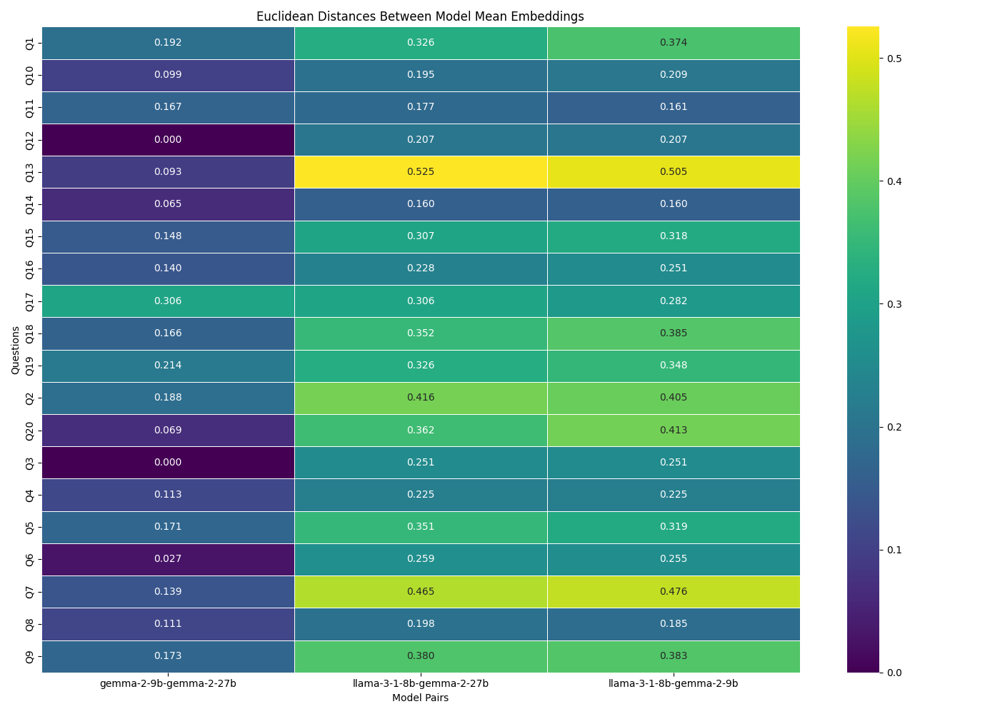
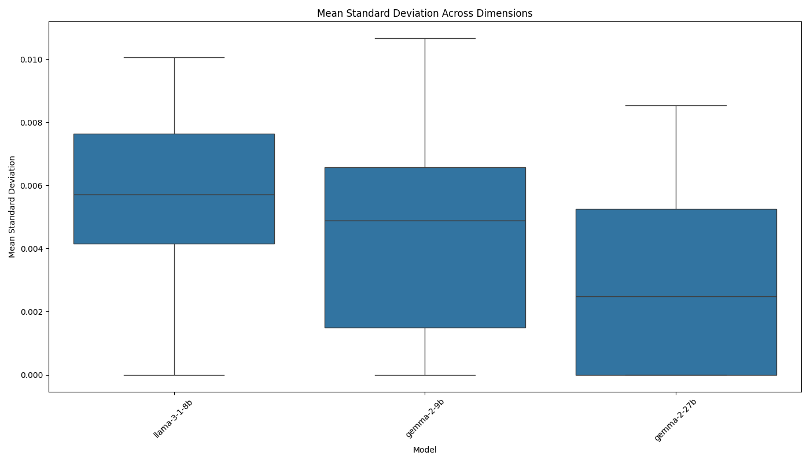
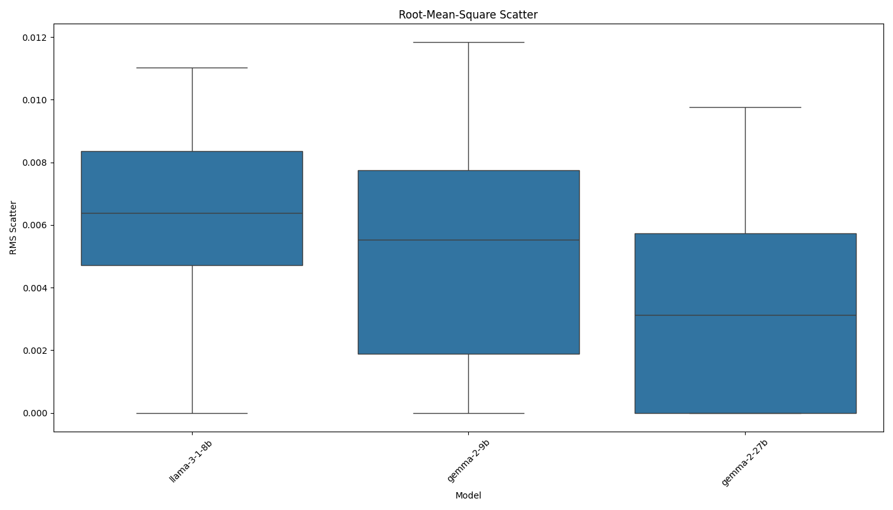

# AI Model Consistency Experiment Report

Analysis generated on: 2025-03-20 00:37:36

## Experiment Overview

- Models tested: llama-3-1-8b, gemma-2-9b, gemma-2-27b
- Number of questions: 20
- Results file: ./results/raw_results_20250320_003735.pkl

## Model Pair Distances

Average Euclidean distances between model mean embeddings across all questions:

| model1       | model2      |   distance |
|:-------------|:------------|-----------:|
| gemma-2-9b   | gemma-2-27b |     0.1290 |
| llama-3-1-8b | gemma-2-27b |     0.3008 |
| llama-3-1-8b | gemma-2-9b  |     0.3057 |

## Consistency Metrics

### Mean Standard Deviation

Average of standard deviations across all embedding dimensions:

| model        |   mean_stddev |
|:-------------|--------------:|
| gemma-2-27b  |        0.0032 |
| gemma-2-9b   |        0.0045 |
| llama-3-1-8b |        0.0054 |

### Root-Mean-Square Scatter

Root-mean-square of standard deviations across all embedding dimensions:

| model        |   rms_scatter |
|:-------------|--------------:|
| gemma-2-27b  |        0.0037 |
| gemma-2-9b   |        0.0052 |
| llama-3-1-8b |        0.0059 |

## Visualizations

### Distance Matrix

### Mean Standard Deviation

### Root-Mean-Square Scatter

## Per-Question Analysis

### Q1

#### Model Distances

| question   | model1       | model2      |   distance |
|:-----------|:-------------|:------------|-----------:|
| Q1         | llama-3-1-8b | gemma-2-9b  |     0.3743 |
| Q1         | llama-3-1-8b | gemma-2-27b |     0.3258 |
| Q1         | gemma-2-9b   | gemma-2-27b |     0.1916 |

#### Consistency Metrics

| model        | question   |   mean_stddev |   rms_scatter |   zero_std_dims | identical_responses   |
|:-------------|:-----------|--------------:|--------------:|----------------:|:----------------------|
| llama-3-1-8b | Q1         |        0.0076 |        0.0083 |               0 | False                 |
| gemma-2-9b   | Q1         |        0.0051 |        0.0058 |               0 | False                 |
| gemma-2-27b  | Q1         |        0.0024 |        0.0031 |               0 | False                 |

### Q2

#### Model Distances

| question   | model1       | model2      |   distance |
|:-----------|:-------------|:------------|-----------:|
| Q2         | llama-3-1-8b | gemma-2-9b  |     0.4051 |
| Q2         | llama-3-1-8b | gemma-2-27b |     0.4156 |
| Q2         | gemma-2-9b   | gemma-2-27b |     0.1882 |

#### Consistency Metrics

| model        | question   |   mean_stddev |   rms_scatter |   zero_std_dims | identical_responses   |
|:-------------|:-----------|--------------:|--------------:|----------------:|:----------------------|
| llama-3-1-8b | Q2         |        0.0083 |        0.0092 |               0 | False                 |
| gemma-2-9b   | Q2         |        0.0107 |        0.0118 |               0 | False                 |
| gemma-2-27b  | Q2         |        0.0070 |        0.0079 |               0 | False                 |

### Q3

#### Model Distances

| question   | model1       | model2      |   distance |
|:-----------|:-------------|:------------|-----------:|
| Q3         | llama-3-1-8b | gemma-2-9b  |     0.2506 |
| Q3         | llama-3-1-8b | gemma-2-27b |     0.2506 |
| Q3         | gemma-2-9b   | gemma-2-27b |     0.0000 |

#### Consistency Metrics

| model        | question   |   mean_stddev |   rms_scatter |   zero_std_dims | identical_responses   |
|:-------------|:-----------|--------------:|--------------:|----------------:|:----------------------|
| llama-3-1-8b | Q3         |        0.0000 |        0.0000 |             679 | True                  |
| gemma-2-9b   | Q3         |        0.0000 |        0.0000 |             669 | True                  |
| gemma-2-27b  | Q3         |        0.0000 |        0.0000 |             669 | True                  |

### Q4

#### Model Distances

| question   | model1       | model2      |   distance |
|:-----------|:-------------|:------------|-----------:|
| Q4         | llama-3-1-8b | gemma-2-9b  |     0.2254 |
| Q4         | llama-3-1-8b | gemma-2-27b |     0.2247 |
| Q4         | gemma-2-9b   | gemma-2-27b |     0.1131 |

#### Consistency Metrics

| model        | question   |   mean_stddev |   rms_scatter |   zero_std_dims | identical_responses   |
|:-------------|:-----------|--------------:|--------------:|----------------:|:----------------------|
| llama-3-1-8b | Q4         |        0.0036 |        0.0039 |               0 | False                 |
| gemma-2-9b   | Q4         |        0.0014 |        0.0017 |               0 | False                 |
| gemma-2-27b  | Q4         |        0.0060 |        0.0068 |               0 | False                 |

### Q5

#### Model Distances

| question   | model1       | model2      |   distance |
|:-----------|:-------------|:------------|-----------:|
| Q5         | llama-3-1-8b | gemma-2-9b  |     0.3191 |
| Q5         | llama-3-1-8b | gemma-2-27b |     0.3510 |
| Q5         | gemma-2-9b   | gemma-2-27b |     0.1706 |

#### Consistency Metrics

| model        | question   |   mean_stddev |   rms_scatter |   zero_std_dims | identical_responses   |
|:-------------|:-----------|--------------:|--------------:|----------------:|:----------------------|
| llama-3-1-8b | Q5         |        0.0078 |        0.0086 |               0 | False                 |
| gemma-2-9b   | Q5         |        0.0069 |        0.0077 |               0 | False                 |
| gemma-2-27b  | Q5         |        0.0000 |        0.0000 |             679 | True                  |

### Q6

#### Model Distances

| question   | model1       | model2      |   distance |
|:-----------|:-------------|:------------|-----------:|
| Q6         | llama-3-1-8b | gemma-2-9b  |     0.2553 |
| Q6         | llama-3-1-8b | gemma-2-27b |     0.2587 |
| Q6         | gemma-2-9b   | gemma-2-27b |     0.0269 |

#### Consistency Metrics

| model        | question   |   mean_stddev |   rms_scatter |   zero_std_dims | identical_responses   |
|:-------------|:-----------|--------------:|--------------:|----------------:|:----------------------|
| llama-3-1-8b | Q6         |        0.0060 |        0.0070 |               0 | False                 |
| gemma-2-9b   | Q6         |        0.0015 |        0.0019 |               0 | False                 |
| gemma-2-27b  | Q6         |        0.0000 |        0.0000 |             679 | True                  |

### Q7

#### Model Distances

| question   | model1       | model2      |   distance |
|:-----------|:-------------|:------------|-----------:|
| Q7         | llama-3-1-8b | gemma-2-9b  |     0.4764 |
| Q7         | llama-3-1-8b | gemma-2-27b |     0.4649 |
| Q7         | gemma-2-9b   | gemma-2-27b |     0.1393 |

#### Consistency Metrics

| model        | question   |   mean_stddev |   rms_scatter |   zero_std_dims | identical_responses   |
|:-------------|:-----------|--------------:|--------------:|----------------:|:----------------------|
| llama-3-1-8b | Q7         |        0.0068 |        0.0073 |               0 | False                 |
| gemma-2-9b   | Q7         |        0.0065 |        0.0080 |               0 | False                 |
| gemma-2-27b  | Q7         |        0.0025 |        0.0032 |               0 | False                 |

### Q8

#### Model Distances

| question   | model1       | model2      |   distance |
|:-----------|:-------------|:------------|-----------:|
| Q8         | llama-3-1-8b | gemma-2-9b  |     0.1848 |
| Q8         | llama-3-1-8b | gemma-2-27b |     0.1981 |
| Q8         | gemma-2-9b   | gemma-2-27b |     0.1108 |

#### Consistency Metrics

| model        | question   |   mean_stddev |   rms_scatter |   zero_std_dims | identical_responses   |
|:-------------|:-----------|--------------:|--------------:|----------------:|:----------------------|
| llama-3-1-8b | Q8         |        0.0057 |        0.0063 |               0 | False                 |
| gemma-2-9b   | Q8         |        0.0037 |        0.0042 |               0 | False                 |
| gemma-2-27b  | Q8         |        0.0052 |        0.0056 |               0 | False                 |

### Q9

#### Model Distances

| question   | model1       | model2      |   distance |
|:-----------|:-------------|:------------|-----------:|
| Q9         | llama-3-1-8b | gemma-2-9b  |     0.3831 |
| Q9         | llama-3-1-8b | gemma-2-27b |     0.3804 |
| Q9         | gemma-2-9b   | gemma-2-27b |     0.1729 |

#### Consistency Metrics

| model        | question   |   mean_stddev |   rms_scatter |   zero_std_dims | identical_responses   |
|:-------------|:-----------|--------------:|--------------:|----------------:|:----------------------|
| llama-3-1-8b | Q9         |        0.0057 |        0.0062 |               0 | False                 |
| gemma-2-9b   | Q9         |        0.0062 |        0.0071 |               0 | False                 |
| gemma-2-27b  | Q9         |        0.0035 |        0.0044 |               0 | False                 |

### Q10

#### Model Distances

| question   | model1       | model2      |   distance |
|:-----------|:-------------|:------------|-----------:|
| Q10        | llama-3-1-8b | gemma-2-9b  |     0.2091 |
| Q10        | llama-3-1-8b | gemma-2-27b |     0.1953 |
| Q10        | gemma-2-9b   | gemma-2-27b |     0.0986 |

#### Consistency Metrics

| model        | question   |   mean_stddev |   rms_scatter |   zero_std_dims | identical_responses   |
|:-------------|:-----------|--------------:|--------------:|----------------:|:----------------------|
| llama-3-1-8b | Q10        |        0.0036 |        0.0039 |               0 | False                 |
| gemma-2-9b   | Q10        |        0.0000 |        0.0000 |             671 | True                  |
| gemma-2-27b  | Q10        |        0.0022 |        0.0026 |               0 | False                 |

### Q11

#### Model Distances

| question   | model1       | model2      |   distance |
|:-----------|:-------------|:------------|-----------:|
| Q11        | llama-3-1-8b | gemma-2-9b  |     0.1612 |
| Q11        | llama-3-1-8b | gemma-2-27b |     0.1773 |
| Q11        | gemma-2-9b   | gemma-2-27b |     0.1665 |

#### Consistency Metrics

| model        | question   |   mean_stddev |   rms_scatter |   zero_std_dims | identical_responses   |
|:-------------|:-----------|--------------:|--------------:|----------------:|:----------------------|
| llama-3-1-8b | Q11        |        0.0065 |        0.0070 |               0 | False                 |
| gemma-2-9b   | Q11        |        0.0061 |        0.0069 |               0 | False                 |
| gemma-2-27b  | Q11        |        0.0021 |        0.0024 |               0 | False                 |

### Q12

#### Model Distances

| question   | model1       | model2      |   distance |
|:-----------|:-------------|:------------|-----------:|
| Q12        | llama-3-1-8b | gemma-2-9b  |     0.2066 |
| Q12        | llama-3-1-8b | gemma-2-27b |     0.2066 |
| Q12        | gemma-2-9b   | gemma-2-27b |     0.0000 |

#### Consistency Metrics

| model        | question   |   mean_stddev |   rms_scatter |   zero_std_dims | identical_responses   |
|:-------------|:-----------|--------------:|--------------:|----------------:|:----------------------|
| llama-3-1-8b | Q12        |        0.0000 |        0.0000 |             683 | True                  |
| gemma-2-9b   | Q12        |        0.0000 |        0.0000 |             697 | True                  |
| gemma-2-27b  | Q12        |        0.0000 |        0.0000 |             697 | True                  |

### Q13

#### Model Distances

| question   | model1       | model2      |   distance |
|:-----------|:-------------|:------------|-----------:|
| Q13        | llama-3-1-8b | gemma-2-9b  |     0.5053 |
| Q13        | llama-3-1-8b | gemma-2-27b |     0.5255 |
| Q13        | gemma-2-9b   | gemma-2-27b |     0.0928 |

#### Consistency Metrics

| model        | question   |   mean_stddev |   rms_scatter |   zero_std_dims | identical_responses   |
|:-------------|:-----------|--------------:|--------------:|----------------:|:----------------------|
| llama-3-1-8b | Q13        |        0.0101 |        0.0110 |               0 | False                 |
| gemma-2-9b   | Q13        |        0.0044 |        0.0053 |               0 | False                 |
| gemma-2-27b  | Q13        |        0.0018 |        0.0023 |               0 | False                 |

### Q14

#### Model Distances

| question   | model1       | model2      |   distance |
|:-----------|:-------------|:------------|-----------:|
| Q14        | llama-3-1-8b | gemma-2-9b  |     0.1599 |
| Q14        | llama-3-1-8b | gemma-2-27b |     0.1595 |
| Q14        | gemma-2-9b   | gemma-2-27b |     0.0654 |

#### Consistency Metrics

| model        | question   |   mean_stddev |   rms_scatter |   zero_std_dims | identical_responses   |
|:-------------|:-----------|--------------:|--------------:|----------------:|:----------------------|
| llama-3-1-8b | Q14        |        0.0000 |        0.0000 |             678 | True                  |
| gemma-2-9b   | Q14        |        0.0037 |        0.0047 |               0 | False                 |
| gemma-2-27b  | Q14        |        0.0000 |        0.0000 |             653 | True                  |

### Q15

#### Model Distances

| question   | model1       | model2      |   distance |
|:-----------|:-------------|:------------|-----------:|
| Q15        | llama-3-1-8b | gemma-2-9b  |     0.3184 |
| Q15        | llama-3-1-8b | gemma-2-27b |     0.3071 |
| Q15        | gemma-2-9b   | gemma-2-27b |     0.1481 |

#### Consistency Metrics

| model        | question   |   mean_stddev |   rms_scatter |   zero_std_dims | identical_responses   |
|:-------------|:-----------|--------------:|--------------:|----------------:|:----------------------|
| llama-3-1-8b | Q15        |        0.0080 |        0.0087 |               0 | False                 |
| gemma-2-9b   | Q15        |        0.0084 |        0.0099 |               0 | False                 |
| gemma-2-27b  | Q15        |        0.0085 |        0.0098 |               0 | False                 |

### Q16

#### Model Distances

| question   | model1       | model2      |   distance |
|:-----------|:-------------|:------------|-----------:|
| Q16        | llama-3-1-8b | gemma-2-9b  |     0.2509 |
| Q16        | llama-3-1-8b | gemma-2-27b |     0.2281 |
| Q16        | gemma-2-9b   | gemma-2-27b |     0.1398 |

#### Consistency Metrics

| model        | question   |   mean_stddev |   rms_scatter |   zero_std_dims | identical_responses   |
|:-------------|:-----------|--------------:|--------------:|----------------:|:----------------------|
| llama-3-1-8b | Q16        |        0.0057 |        0.0065 |               0 | False                 |
| gemma-2-9b   | Q16        |        0.0046 |        0.0051 |               0 | False                 |
| gemma-2-27b  | Q16        |        0.0052 |        0.0057 |               0 | False                 |

### Q17

#### Model Distances

| question   | model1       | model2      |   distance |
|:-----------|:-------------|:------------|-----------:|
| Q17        | llama-3-1-8b | gemma-2-9b  |     0.2819 |
| Q17        | llama-3-1-8b | gemma-2-27b |     0.3064 |
| Q17        | gemma-2-9b   | gemma-2-27b |     0.3063 |

#### Consistency Metrics

| model        | question   |   mean_stddev |   rms_scatter |   zero_std_dims | identical_responses   |
|:-------------|:-----------|--------------:|--------------:|----------------:|:----------------------|
| llama-3-1-8b | Q17        |        0.0081 |        0.0090 |               0 | False                 |
| gemma-2-9b   | Q17        |        0.0071 |        0.0078 |               0 | False                 |
| gemma-2-27b  | Q17        |        0.0000 |        0.0000 |             674 | True                  |

### Q18

#### Model Distances

| question   | model1       | model2      |   distance |
|:-----------|:-------------|:------------|-----------:|
| Q18        | llama-3-1-8b | gemma-2-9b  |     0.3855 |
| Q18        | llama-3-1-8b | gemma-2-27b |     0.3525 |
| Q18        | gemma-2-9b   | gemma-2-27b |     0.1657 |

#### Consistency Metrics

| model        | question   |   mean_stddev |   rms_scatter |   zero_std_dims | identical_responses   |
|:-------------|:-----------|--------------:|--------------:|----------------:|:----------------------|
| llama-3-1-8b | Q18        |        0.0052 |        0.0060 |               0 | False                 |
| gemma-2-9b   | Q18        |        0.0078 |        0.0088 |               0 | False                 |
| gemma-2-27b  | Q18        |        0.0082 |        0.0092 |               0 | False                 |

### Q19

#### Model Distances

| question   | model1       | model2      |   distance |
|:-----------|:-------------|:------------|-----------:|
| Q19        | llama-3-1-8b | gemma-2-9b  |     0.3476 |
| Q19        | llama-3-1-8b | gemma-2-27b |     0.3258 |
| Q19        | gemma-2-9b   | gemma-2-27b |     0.2138 |

#### Consistency Metrics

| model        | question   |   mean_stddev |   rms_scatter |   zero_std_dims | identical_responses   |
|:-------------|:-----------|--------------:|--------------:|----------------:|:----------------------|
| llama-3-1-8b | Q19        |        0.0046 |        0.0050 |               0 | False                 |
| gemma-2-9b   | Q19        |        0.0063 |        0.0071 |               0 | False                 |
| gemma-2-27b  | Q19        |        0.0054 |        0.0060 |               0 | False                 |

### Q20

#### Model Distances

| question   | model1       | model2      |   distance |
|:-----------|:-------------|:------------|-----------:|
| Q20        | llama-3-1-8b | gemma-2-9b  |     0.4129 |
| Q20        | llama-3-1-8b | gemma-2-27b |     0.3622 |
| Q20        | gemma-2-9b   | gemma-2-27b |     0.0688 |

#### Consistency Metrics

| model        | question   |   mean_stddev |   rms_scatter |   zero_std_dims | identical_responses   |
|:-------------|:-----------|--------------:|--------------:|----------------:|:----------------------|
| llama-3-1-8b | Q20        |        0.0044 |        0.0051 |               0 | False                 |
| gemma-2-9b   | Q20        |        0.0000 |        0.0000 |             664 | True                  |
| gemma-2-27b  | Q20        |        0.0039 |        0.0050 |               0 | False                 |

