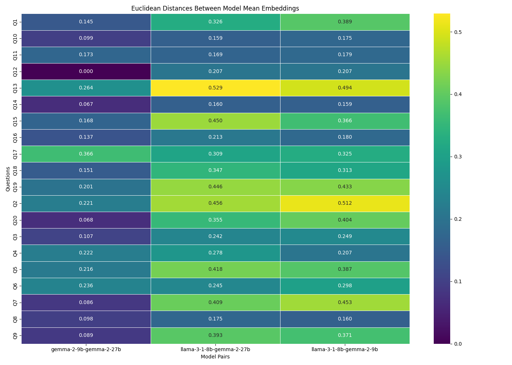
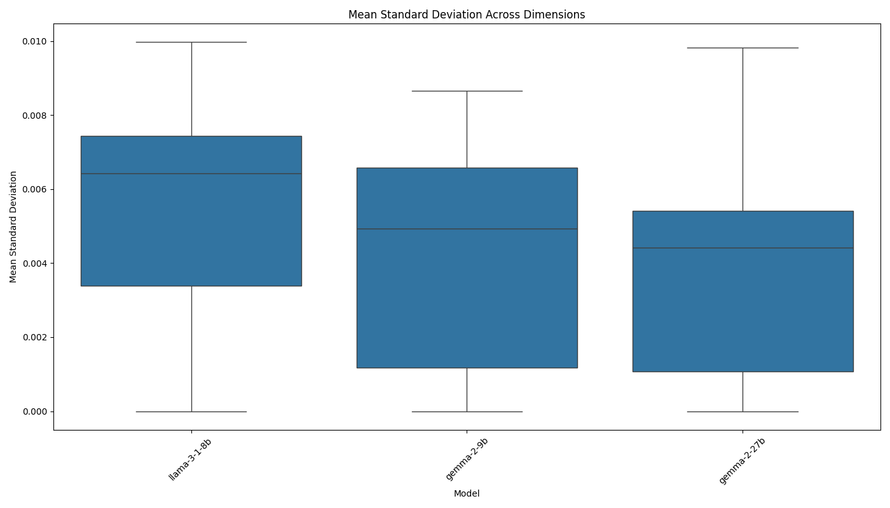
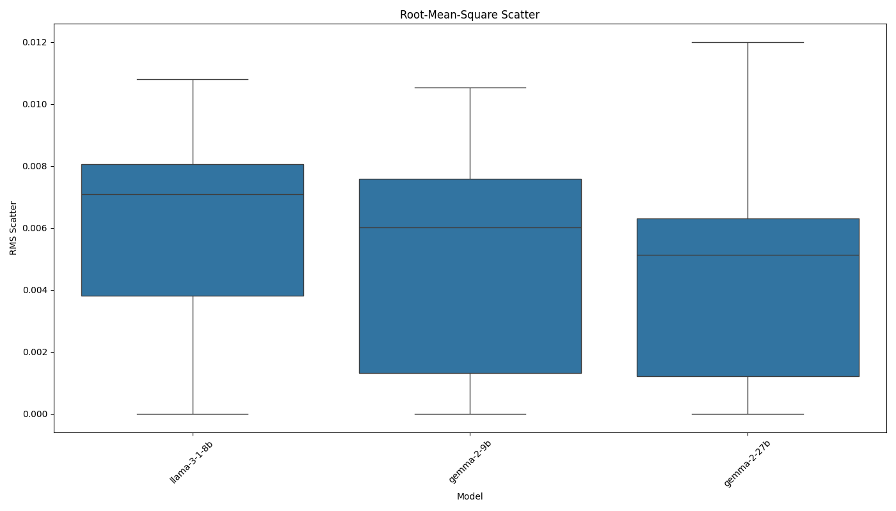

# AI Model Consistency Experiment Report

Analysis generated on: 2025-03-18 00:29:12

## Experiment Overview

- Models tested: llama-3-1-8b, gemma-2-9b, gemma-2-27b
- Number of questions: 20
- Results file: ./results/raw_results_20250318_002911.pkl

## Model Pair Distances

Average Euclidean distances between model mean embeddings across all questions:

| model1       | model2      |   distance |
|:-------------|:------------|-----------:|
| gemma-2-9b   | gemma-2-27b |     0.1558 |
| llama-3-1-8b | gemma-2-9b  |     0.3129 |
| llama-3-1-8b | gemma-2-27b |     0.3141 |

## Consistency Metrics

### Mean Standard Deviation

Average of standard deviations across all embedding dimensions:

| model        |   mean_stddev |
|:-------------|--------------:|
| gemma-2-27b  |        0.0037 |
| gemma-2-9b   |        0.0041 |
| llama-3-1-8b |        0.0056 |

### Root-Mean-Square Scatter

Root-mean-square of standard deviations across all embedding dimensions:

| model        |   rms_scatter |
|:-------------|--------------:|
| gemma-2-27b  |        0.0043 |
| gemma-2-9b   |        0.0048 |
| llama-3-1-8b |        0.0062 |

## Visualizations

### Distance Matrix

### Mean Standard Deviation

### Root-Mean-Square Scatter

## Per-Question Analysis

### Q1

#### Model Distances

| question   | model1       | model2      |   distance |
|:-----------|:-------------|:------------|-----------:|
| Q1         | llama-3-1-8b | gemma-2-9b  |     0.3891 |
| Q1         | llama-3-1-8b | gemma-2-27b |     0.3263 |
| Q1         | gemma-2-9b   | gemma-2-27b |     0.1449 |

#### Consistency Metrics

| model        | question   |   mean_stddev |   rms_scatter |
|:-------------|:-----------|--------------:|--------------:|
| llama-3-1-8b | Q1         |        0.0086 |        0.0094 |
| gemma-2-9b   | Q1         |        0.0016 |        0.0018 |
| gemma-2-27b  | Q1         |        0.0051 |        0.0058 |

### Q2

#### Model Distances

| question   | model1       | model2      |   distance |
|:-----------|:-------------|:------------|-----------:|
| Q2         | llama-3-1-8b | gemma-2-9b  |     0.5117 |
| Q2         | llama-3-1-8b | gemma-2-27b |     0.4561 |
| Q2         | gemma-2-9b   | gemma-2-27b |     0.2213 |

#### Consistency Metrics

| model        | question   |   mean_stddev |   rms_scatter |
|:-------------|:-----------|--------------:|--------------:|
| llama-3-1-8b | Q2         |        0.0100 |        0.0108 |
| gemma-2-9b   | Q2         |        0.0000 |        0.0000 |
| gemma-2-27b  | Q2         |        0.0054 |        0.0066 |

### Q3

#### Model Distances

| question   | model1       | model2      |   distance |
|:-----------|:-------------|:------------|-----------:|
| Q3         | llama-3-1-8b | gemma-2-9b  |     0.2485 |
| Q3         | llama-3-1-8b | gemma-2-27b |     0.2416 |
| Q3         | gemma-2-9b   | gemma-2-27b |     0.1066 |

#### Consistency Metrics

| model        | question   |   mean_stddev |   rms_scatter |
|:-------------|:-----------|--------------:|--------------:|
| llama-3-1-8b | Q3         |        0.0000 |        0.0000 |
| gemma-2-9b   | Q3         |        0.0020 |        0.0025 |
| gemma-2-27b  | Q3         |        0.0064 |        0.0081 |

### Q4

#### Model Distances

| question   | model1       | model2      |   distance |
|:-----------|:-------------|:------------|-----------:|
| Q4         | llama-3-1-8b | gemma-2-9b  |     0.2066 |
| Q4         | llama-3-1-8b | gemma-2-27b |     0.2784 |
| Q4         | gemma-2-9b   | gemma-2-27b |     0.2221 |

#### Consistency Metrics

| model        | question   |   mean_stddev |   rms_scatter |
|:-------------|:-----------|--------------:|--------------:|
| llama-3-1-8b | Q4         |        0.0061 |        0.0067 |
| gemma-2-9b   | Q4         |        0.0050 |        0.0060 |
| gemma-2-27b  | Q4         |        0.0025 |        0.0028 |

### Q5

#### Model Distances

| question   | model1       | model2      |   distance |
|:-----------|:-------------|:------------|-----------:|
| Q5         | llama-3-1-8b | gemma-2-9b  |     0.3873 |
| Q5         | llama-3-1-8b | gemma-2-27b |     0.4179 |
| Q5         | gemma-2-9b   | gemma-2-27b |     0.2160 |

#### Consistency Metrics

| model        | question   |   mean_stddev |   rms_scatter |
|:-------------|:-----------|--------------:|--------------:|
| llama-3-1-8b | Q5         |        0.0093 |        0.0100 |
| gemma-2-9b   | Q5         |        0.0069 |        0.0078 |
| gemma-2-27b  | Q5         |        0.0000 |        0.0000 |

### Q6

#### Model Distances

| question   | model1       | model2      |   distance |
|:-----------|:-------------|:------------|-----------:|
| Q6         | llama-3-1-8b | gemma-2-9b  |     0.2976 |
| Q6         | llama-3-1-8b | gemma-2-27b |     0.2447 |
| Q6         | gemma-2-9b   | gemma-2-27b |     0.2364 |

#### Consistency Metrics

| model        | question   |   mean_stddev |   rms_scatter |
|:-------------|:-----------|--------------:|--------------:|
| llama-3-1-8b | Q6         |        0.0061 |        0.0069 |
| gemma-2-9b   | Q6         |        0.0087 |        0.0105 |
| gemma-2-27b  | Q6         |        0.0000 |        0.0000 |

### Q7

#### Model Distances

| question   | model1       | model2      |   distance |
|:-----------|:-------------|:------------|-----------:|
| Q7         | llama-3-1-8b | gemma-2-9b  |     0.4529 |
| Q7         | llama-3-1-8b | gemma-2-27b |     0.4088 |
| Q7         | gemma-2-9b   | gemma-2-27b |     0.0861 |

#### Consistency Metrics

| model        | question   |   mean_stddev |   rms_scatter |
|:-------------|:-----------|--------------:|--------------:|
| llama-3-1-8b | Q7         |        0.0068 |        0.0073 |
| gemma-2-9b   | Q7         |        0.0000 |        0.0000 |
| gemma-2-27b  | Q7         |        0.0050 |        0.0062 |

### Q8

#### Model Distances

| question   | model1       | model2      |   distance |
|:-----------|:-------------|:------------|-----------:|
| Q8         | llama-3-1-8b | gemma-2-9b  |     0.1597 |
| Q8         | llama-3-1-8b | gemma-2-27b |     0.1750 |
| Q8         | gemma-2-9b   | gemma-2-27b |     0.0981 |

#### Consistency Metrics

| model        | question   |   mean_stddev |   rms_scatter |
|:-------------|:-----------|--------------:|--------------:|
| llama-3-1-8b | Q8         |        0.0064 |        0.0070 |
| gemma-2-9b   | Q8         |        0.0060 |        0.0067 |
| gemma-2-27b  | Q8         |        0.0058 |        0.0063 |

### Q9

#### Model Distances

| question   | model1       | model2      |   distance |
|:-----------|:-------------|:------------|-----------:|
| Q9         | llama-3-1-8b | gemma-2-9b  |     0.3708 |
| Q9         | llama-3-1-8b | gemma-2-27b |     0.3926 |
| Q9         | gemma-2-9b   | gemma-2-27b |     0.0887 |

#### Consistency Metrics

| model        | question   |   mean_stddev |   rms_scatter |
|:-------------|:-----------|--------------:|--------------:|
| llama-3-1-8b | Q9         |        0.0064 |        0.0071 |
| gemma-2-9b   | Q9         |        0.0048 |        0.0061 |
| gemma-2-27b  | Q9         |        0.0029 |        0.0036 |

### Q10

#### Model Distances

| question   | model1       | model2      |   distance |
|:-----------|:-------------|:------------|-----------:|
| Q10        | llama-3-1-8b | gemma-2-9b  |     0.1752 |
| Q10        | llama-3-1-8b | gemma-2-27b |     0.1592 |
| Q10        | gemma-2-9b   | gemma-2-27b |     0.0987 |

#### Consistency Metrics

| model        | question   |   mean_stddev |   rms_scatter |
|:-------------|:-----------|--------------:|--------------:|
| llama-3-1-8b | Q10        |        0.0031 |        0.0034 |
| gemma-2-9b   | Q10        |        0.0000 |        0.0000 |
| gemma-2-27b  | Q10        |        0.0020 |        0.0025 |

### Q11

#### Model Distances

| question   | model1       | model2      |   distance |
|:-----------|:-------------|:------------|-----------:|
| Q11        | llama-3-1-8b | gemma-2-9b  |     0.1790 |
| Q11        | llama-3-1-8b | gemma-2-27b |     0.1691 |
| Q11        | gemma-2-9b   | gemma-2-27b |     0.1734 |

#### Consistency Metrics

| model        | question   |   mean_stddev |   rms_scatter |
|:-------------|:-----------|--------------:|--------------:|
| llama-3-1-8b | Q11        |        0.0073 |        0.0078 |
| gemma-2-9b   | Q11        |        0.0034 |        0.0038 |
| gemma-2-27b  | Q11        |        0.0014 |        0.0016 |

### Q12

#### Model Distances

| question   | model1       | model2      |   distance |
|:-----------|:-------------|:------------|-----------:|
| Q12        | llama-3-1-8b | gemma-2-9b  |     0.2066 |
| Q12        | llama-3-1-8b | gemma-2-27b |     0.2066 |
| Q12        | gemma-2-9b   | gemma-2-27b |     0.0000 |

#### Consistency Metrics

| model        | question   |   mean_stddev |   rms_scatter |
|:-------------|:-----------|--------------:|--------------:|
| llama-3-1-8b | Q12        |        0.0000 |        0.0000 |
| gemma-2-9b   | Q12        |        0.0000 |        0.0000 |
| gemma-2-27b  | Q12        |        0.0000 |        0.0000 |

### Q13

#### Model Distances

| question   | model1       | model2      |   distance |
|:-----------|:-------------|:------------|-----------:|
| Q13        | llama-3-1-8b | gemma-2-9b  |     0.4938 |
| Q13        | llama-3-1-8b | gemma-2-27b |     0.5291 |
| Q13        | gemma-2-9b   | gemma-2-27b |     0.2643 |

#### Consistency Metrics

| model        | question   |   mean_stddev |   rms_scatter |
|:-------------|:-----------|--------------:|--------------:|
| llama-3-1-8b | Q13        |        0.0094 |        0.0102 |
| gemma-2-9b   | Q13        |        0.0058 |        0.0072 |
| gemma-2-27b  | Q13        |        0.0098 |        0.0120 |

### Q14

#### Model Distances

| question   | model1       | model2      |   distance |
|:-----------|:-------------|:------------|-----------:|
| Q14        | llama-3-1-8b | gemma-2-9b  |     0.1592 |
| Q14        | llama-3-1-8b | gemma-2-27b |     0.1595 |
| Q14        | gemma-2-9b   | gemma-2-27b |     0.0669 |

#### Consistency Metrics

| model        | question   |   mean_stddev |   rms_scatter |
|:-------------|:-----------|--------------:|--------------:|
| llama-3-1-8b | Q14        |        0.0000 |        0.0000 |
| gemma-2-9b   | Q14        |        0.0038 |        0.0048 |
| gemma-2-27b  | Q14        |        0.0000 |        0.0000 |

### Q15

#### Model Distances

| question   | model1       | model2      |   distance |
|:-----------|:-------------|:------------|-----------:|
| Q15        | llama-3-1-8b | gemma-2-9b  |     0.3660 |
| Q15        | llama-3-1-8b | gemma-2-27b |     0.4495 |
| Q15        | gemma-2-9b   | gemma-2-27b |     0.1680 |

#### Consistency Metrics

| model        | question   |   mean_stddev |   rms_scatter |
|:-------------|:-----------|--------------:|--------------:|
| llama-3-1-8b | Q15        |        0.0071 |        0.0078 |
| gemma-2-9b   | Q15        |        0.0065 |        0.0078 |
| gemma-2-27b  | Q15        |        0.0056 |        0.0064 |

### Q16

#### Model Distances

| question   | model1       | model2      |   distance |
|:-----------|:-------------|:------------|-----------:|
| Q16        | llama-3-1-8b | gemma-2-9b  |     0.1795 |
| Q16        | llama-3-1-8b | gemma-2-27b |     0.2125 |
| Q16        | gemma-2-9b   | gemma-2-27b |     0.1373 |

#### Consistency Metrics

| model        | question   |   mean_stddev |   rms_scatter |
|:-------------|:-----------|--------------:|--------------:|
| llama-3-1-8b | Q16        |        0.0066 |        0.0074 |
| gemma-2-9b   | Q16        |        0.0056 |        0.0061 |
| gemma-2-27b  | Q16        |        0.0050 |        0.0053 |

### Q17

#### Model Distances

| question   | model1       | model2      |   distance |
|:-----------|:-------------|:------------|-----------:|
| Q17        | llama-3-1-8b | gemma-2-9b  |     0.3254 |
| Q17        | llama-3-1-8b | gemma-2-27b |     0.3087 |
| Q17        | gemma-2-9b   | gemma-2-27b |     0.3655 |

#### Consistency Metrics

| model        | question   |   mean_stddev |   rms_scatter |
|:-------------|:-----------|--------------:|--------------:|
| llama-3-1-8b | Q17        |        0.0078 |        0.0088 |
| gemma-2-9b   | Q17        |        0.0067 |        0.0075 |
| gemma-2-27b  | Q17        |        0.0000 |        0.0000 |

### Q18

#### Model Distances

| question   | model1       | model2      |   distance |
|:-----------|:-------------|:------------|-----------:|
| Q18        | llama-3-1-8b | gemma-2-9b  |     0.3125 |
| Q18        | llama-3-1-8b | gemma-2-27b |     0.3466 |
| Q18        | gemma-2-9b   | gemma-2-27b |     0.1512 |

#### Consistency Metrics

| model        | question   |   mean_stddev |   rms_scatter |
|:-------------|:-----------|--------------:|--------------:|
| llama-3-1-8b | Q18        |        0.0035 |        0.0038 |
| gemma-2-9b   | Q18        |        0.0083 |        0.0091 |
| gemma-2-27b  | Q18        |        0.0078 |        0.0088 |

### Q19

#### Model Distances

| question   | model1       | model2      |   distance |
|:-----------|:-------------|:------------|-----------:|
| Q19        | llama-3-1-8b | gemma-2-9b  |     0.4330 |
| Q19        | llama-3-1-8b | gemma-2-27b |     0.4462 |
| Q19        | gemma-2-9b   | gemma-2-27b |     0.2013 |

#### Consistency Metrics

| model        | question   |   mean_stddev |   rms_scatter |
|:-------------|:-----------|--------------:|--------------:|
| llama-3-1-8b | Q19        |        0.0030 |        0.0037 |
| gemma-2-9b   | Q19        |        0.0072 |        0.0080 |
| gemma-2-27b  | Q19        |        0.0053 |        0.0057 |

### Q20

#### Model Distances

| question   | model1       | model2      |   distance |
|:-----------|:-------------|:------------|-----------:|
| Q20        | llama-3-1-8b | gemma-2-9b  |     0.4037 |
| Q20        | llama-3-1-8b | gemma-2-27b |     0.3546 |
| Q20        | gemma-2-9b   | gemma-2-27b |     0.0684 |

#### Consistency Metrics

| model        | question   |   mean_stddev |   rms_scatter |
|:-------------|:-----------|--------------:|--------------:|
| llama-3-1-8b | Q20        |        0.0055 |        0.0062 |
| gemma-2-9b   | Q20        |        0.0000 |        0.0000 |
| gemma-2-27b  | Q20        |        0.0039 |        0.0049 |

