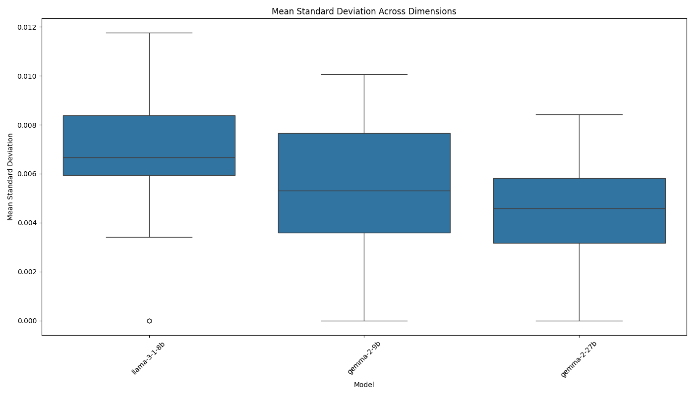
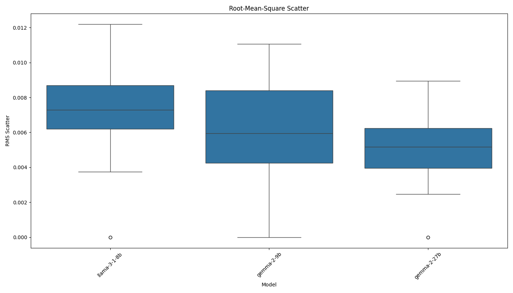

# AI Model Consistency Experiment Report

Analysis generated on: 2025-03-21 21:36:52

## Experiment Overview

- Models tested: llama-3-1-8b, gemma-2-9b, gemma-2-27b
- Number of questions: 20
- Results file: ./results/raw_results_20250321_213651.pkl

## Model Pair Distances

Average Euclidean distances between model mean embeddings across all questions:

| model1       | model2      |   distance |
|:-------------|:------------|-----------:|
| gemma-2-9b   | gemma-2-27b |     0.1193 |
| llama-3-1-8b | gemma-2-27b |     0.2911 |
| llama-3-1-8b | gemma-2-9b  |     0.2933 |

## Consistency Metrics

### Mean Standard Deviation

Average of standard deviations across all embedding dimensions:

| model        |   mean_stddev |
|:-------------|--------------:|
| gemma-2-27b  |        0.0042 |
| gemma-2-9b   |        0.0053 |
| llama-3-1-8b |        0.0064 |

### Root-Mean-Square Scatter

Root-mean-square of standard deviations across all embedding dimensions:

| model        |   rms_scatter |
|:-------------|--------------:|
| gemma-2-27b  |        0.0048 |
| gemma-2-9b   |        0.0058 |
| llama-3-1-8b |        0.0068 |

## Visualizations

### Distance Matrix

### Mean Standard Deviation

### Root-Mean-Square Scatter

## Per-Question Analysis

### Q1

#### Model Distances

| question   | model1       | model2      |   distance |
|:-----------|:-------------|:------------|-----------:|
| Q1         | llama-3-1-8b | gemma-2-9b  |     0.3716 |
| Q1         | llama-3-1-8b | gemma-2-27b |     0.3251 |
| Q1         | gemma-2-9b   | gemma-2-27b |     0.1135 |

#### Consistency Metrics

| model        | question   |   mean_stddev |   rms_scatter |   zero_std_dims | identical_responses   |
|:-------------|:-----------|--------------:|--------------:|----------------:|:----------------------|
| llama-3-1-8b | Q1         |        0.0089 |        0.0093 |               0 | False                 |
| gemma-2-9b   | Q1         |        0.0037 |        0.0039 |               0 | False                 |
| gemma-2-27b  | Q1         |        0.0051 |        0.0055 |               0 | False                 |

### Q2

#### Model Distances

| question   | model1       | model2      |   distance |
|:-----------|:-------------|:------------|-----------:|
| Q2         | llama-3-1-8b | gemma-2-9b  |     0.3655 |
| Q2         | llama-3-1-8b | gemma-2-27b |     0.3858 |
| Q2         | gemma-2-9b   | gemma-2-27b |     0.0702 |

#### Consistency Metrics

| model        | question   |   mean_stddev |   rms_scatter |   zero_std_dims | identical_responses   |
|:-------------|:-----------|--------------:|--------------:|----------------:|:----------------------|
| llama-3-1-8b | Q2         |        0.0115 |        0.0120 |               0 | False                 |
| gemma-2-9b   | Q2         |        0.0088 |        0.0095 |               0 | False                 |
| gemma-2-27b  | Q2         |        0.0069 |        0.0079 |               0 | False                 |

### Q3

#### Model Distances

| question   | model1       | model2      |   distance |
|:-----------|:-------------|:------------|-----------:|
| Q3         | llama-3-1-8b | gemma-2-9b  |     0.2506 |
| Q3         | llama-3-1-8b | gemma-2-27b |     0.2506 |
| Q3         | gemma-2-9b   | gemma-2-27b |     0.0000 |

#### Consistency Metrics

| model        | question   |   mean_stddev |   rms_scatter |   zero_std_dims | identical_responses   |
|:-------------|:-----------|--------------:|--------------:|----------------:|:----------------------|
| llama-3-1-8b | Q3         |        0.0000 |        0.0000 |             136 | True                  |
| gemma-2-9b   | Q3         |        0.0000 |        0.0000 |             146 | True                  |
| gemma-2-27b  | Q3         |        0.0000 |        0.0000 |             146 | True                  |

### Q4

#### Model Distances

| question   | model1       | model2      |   distance |
|:-----------|:-------------|:------------|-----------:|
| Q4         | llama-3-1-8b | gemma-2-9b  |     0.2003 |
| Q4         | llama-3-1-8b | gemma-2-27b |     0.2344 |
| Q4         | gemma-2-9b   | gemma-2-27b |     0.1286 |

#### Consistency Metrics

| model        | question   |   mean_stddev |   rms_scatter |   zero_std_dims | identical_responses   |
|:-------------|:-----------|--------------:|--------------:|----------------:|:----------------------|
| llama-3-1-8b | Q4         |        0.0068 |        0.0075 |               0 | False                 |
| gemma-2-9b   | Q4         |        0.0052 |        0.0060 |               0 | False                 |
| gemma-2-27b  | Q4         |        0.0041 |        0.0046 |               0 | False                 |

### Q5

#### Model Distances

| question   | model1       | model2      |   distance |
|:-----------|:-------------|:------------|-----------:|
| Q5         | llama-3-1-8b | gemma-2-9b  |     0.3350 |
| Q5         | llama-3-1-8b | gemma-2-27b |     0.3485 |
| Q5         | gemma-2-9b   | gemma-2-27b |     0.1503 |

#### Consistency Metrics

| model        | question   |   mean_stddev |   rms_scatter |   zero_std_dims | identical_responses   |
|:-------------|:-----------|--------------:|--------------:|----------------:|:----------------------|
| llama-3-1-8b | Q5         |        0.0095 |        0.0100 |               0 | False                 |
| gemma-2-9b   | Q5         |        0.0098 |        0.0106 |               0 | False                 |
| gemma-2-27b  | Q5         |        0.0039 |        0.0049 |               0 | False                 |

### Q6

#### Model Distances

| question   | model1       | model2      |   distance |
|:-----------|:-------------|:------------|-----------:|
| Q6         | llama-3-1-8b | gemma-2-9b  |     0.3035 |
| Q6         | llama-3-1-8b | gemma-2-27b |     0.2965 |
| Q6         | gemma-2-9b   | gemma-2-27b |     0.1639 |

#### Consistency Metrics

| model        | question   |   mean_stddev |   rms_scatter |   zero_std_dims | identical_responses   |
|:-------------|:-----------|--------------:|--------------:|----------------:|:----------------------|
| llama-3-1-8b | Q6         |        0.0066 |        0.0071 |               0 | False                 |
| gemma-2-9b   | Q6         |        0.0101 |        0.0111 |               0 | False                 |
| gemma-2-27b  | Q6         |        0.0030 |        0.0037 |               0 | False                 |

### Q7

#### Model Distances

| question   | model1       | model2      |   distance |
|:-----------|:-------------|:------------|-----------:|
| Q7         | llama-3-1-8b | gemma-2-9b  |     0.4041 |
| Q7         | llama-3-1-8b | gemma-2-27b |     0.3667 |
| Q7         | gemma-2-9b   | gemma-2-27b |     0.0541 |

#### Consistency Metrics

| model        | question   |   mean_stddev |   rms_scatter |   zero_std_dims | identical_responses   |
|:-------------|:-----------|--------------:|--------------:|----------------:|:----------------------|
| llama-3-1-8b | Q7         |        0.0083 |        0.0085 |               0 | False                 |
| gemma-2-9b   | Q7         |        0.0044 |        0.0050 |               0 | False                 |
| gemma-2-27b  | Q7         |        0.0060 |        0.0067 |               0 | False                 |

### Q8

#### Model Distances

| question   | model1       | model2      |   distance |
|:-----------|:-------------|:------------|-----------:|
| Q8         | llama-3-1-8b | gemma-2-9b  |     0.1598 |
| Q8         | llama-3-1-8b | gemma-2-27b |     0.1548 |
| Q8         | gemma-2-9b   | gemma-2-27b |     0.1257 |

#### Consistency Metrics

| model        | question   |   mean_stddev |   rms_scatter |   zero_std_dims | identical_responses   |
|:-------------|:-----------|--------------:|--------------:|----------------:|:----------------------|
| llama-3-1-8b | Q8         |        0.0072 |        0.0077 |               0 | False                 |
| gemma-2-9b   | Q8         |        0.0045 |        0.0048 |               0 | False                 |
| gemma-2-27b  | Q8         |        0.0058 |        0.0061 |               0 | False                 |

### Q9

#### Model Distances

| question   | model1       | model2      |   distance |
|:-----------|:-------------|:------------|-----------:|
| Q9         | llama-3-1-8b | gemma-2-9b  |     0.3594 |
| Q9         | llama-3-1-8b | gemma-2-27b |     0.3574 |
| Q9         | gemma-2-9b   | gemma-2-27b |     0.1578 |

#### Consistency Metrics

| model        | question   |   mean_stddev |   rms_scatter |   zero_std_dims | identical_responses   |
|:-------------|:-----------|--------------:|--------------:|----------------:|:----------------------|
| llama-3-1-8b | Q9         |        0.0059 |        0.0062 |               0 | False                 |
| gemma-2-9b   | Q9         |        0.0059 |        0.0063 |               0 | False                 |
| gemma-2-27b  | Q9         |        0.0032 |        0.0040 |               0 | False                 |

### Q10

#### Model Distances

| question   | model1       | model2      |   distance |
|:-----------|:-------------|:------------|-----------:|
| Q10        | llama-3-1-8b | gemma-2-9b  |     0.1866 |
| Q10        | llama-3-1-8b | gemma-2-27b |     0.1708 |
| Q10        | gemma-2-9b   | gemma-2-27b |     0.1022 |

#### Consistency Metrics

| model        | question   |   mean_stddev |   rms_scatter |   zero_std_dims | identical_responses   |
|:-------------|:-----------|--------------:|--------------:|----------------:|:----------------------|
| llama-3-1-8b | Q10        |        0.0034 |        0.0038 |               0 | False                 |
| gemma-2-9b   | Q10        |        0.0000 |        0.0000 |             149 | True                  |
| gemma-2-27b  | Q10        |        0.0021 |        0.0025 |               0 | False                 |

### Q11

#### Model Distances

| question   | model1       | model2      |   distance |
|:-----------|:-------------|:------------|-----------:|
| Q11        | llama-3-1-8b | gemma-2-9b  |     0.1992 |
| Q11        | llama-3-1-8b | gemma-2-27b |     0.1622 |
| Q11        | gemma-2-9b   | gemma-2-27b |     0.1364 |

#### Consistency Metrics

| model        | question   |   mean_stddev |   rms_scatter |   zero_std_dims | identical_responses   |
|:-------------|:-----------|--------------:|--------------:|----------------:|:----------------------|
| llama-3-1-8b | Q11        |        0.0079 |        0.0082 |               0 | False                 |
| gemma-2-9b   | Q11        |        0.0051 |        0.0054 |               0 | False                 |
| gemma-2-27b  | Q11        |        0.0039 |        0.0043 |               0 | False                 |

### Q12

#### Model Distances

| question   | model1       | model2      |   distance |
|:-----------|:-------------|:------------|-----------:|
| Q12        | llama-3-1-8b | gemma-2-9b  |     0.2072 |
| Q12        | llama-3-1-8b | gemma-2-27b |     0.2015 |
| Q12        | gemma-2-9b   | gemma-2-27b |     0.0377 |

#### Consistency Metrics

| model        | question   |   mean_stddev |   rms_scatter |   zero_std_dims | identical_responses   |
|:-------------|:-----------|--------------:|--------------:|----------------:|:----------------------|
| llama-3-1-8b | Q12        |        0.0000 |        0.0000 |             154 | True                  |
| gemma-2-9b   | Q12        |        0.0010 |        0.0012 |               0 | False                 |
| gemma-2-27b  | Q12        |        0.0051 |        0.0065 |               0 | False                 |

### Q13

#### Model Distances

| question   | model1       | model2      |   distance |
|:-----------|:-------------|:------------|-----------:|
| Q13        | llama-3-1-8b | gemma-2-9b  |     0.4591 |
| Q13        | llama-3-1-8b | gemma-2-27b |     0.4702 |
| Q13        | gemma-2-9b   | gemma-2-27b |     0.0663 |

#### Consistency Metrics

| model        | question   |   mean_stddev |   rms_scatter |   zero_std_dims | identical_responses   |
|:-------------|:-----------|--------------:|--------------:|----------------:|:----------------------|
| llama-3-1-8b | Q13        |        0.0118 |        0.0122 |               0 | False                 |
| gemma-2-9b   | Q13        |        0.0075 |        0.0083 |               0 | False                 |
| gemma-2-27b  | Q13        |        0.0059 |        0.0069 |               0 | False                 |

### Q14

#### Model Distances

| question   | model1       | model2      |   distance |
|:-----------|:-------------|:------------|-----------:|
| Q14        | llama-3-1-8b | gemma-2-9b  |     0.1577 |
| Q14        | llama-3-1-8b | gemma-2-27b |     0.1595 |
| Q14        | gemma-2-9b   | gemma-2-27b |     0.0524 |

#### Consistency Metrics

| model        | question   |   mean_stddev |   rms_scatter |   zero_std_dims | identical_responses   |
|:-------------|:-----------|--------------:|--------------:|----------------:|:----------------------|
| llama-3-1-8b | Q14        |        0.0000 |        0.0000 |             146 | True                  |
| gemma-2-9b   | Q14        |        0.0034 |        0.0043 |               0 | False                 |
| gemma-2-27b  | Q14        |        0.0000 |        0.0000 |             154 | True                  |

### Q15

#### Model Distances

| question   | model1       | model2      |   distance |
|:-----------|:-------------|:------------|-----------:|
| Q15        | llama-3-1-8b | gemma-2-9b  |     0.4207 |
| Q15        | llama-3-1-8b | gemma-2-27b |     0.4093 |
| Q15        | gemma-2-9b   | gemma-2-27b |     0.0579 |

#### Consistency Metrics

| model        | question   |   mean_stddev |   rms_scatter |   zero_std_dims | identical_responses   |
|:-------------|:-----------|--------------:|--------------:|----------------:|:----------------------|
| llama-3-1-8b | Q15        |        0.0066 |        0.0069 |               0 | False                 |
| gemma-2-9b   | Q15        |        0.0070 |        0.0077 |               0 | False                 |
| gemma-2-27b  | Q15        |        0.0084 |        0.0089 |               0 | False                 |

### Q16

#### Model Distances

| question   | model1       | model2      |   distance |
|:-----------|:-------------|:------------|-----------:|
| Q16        | llama-3-1-8b | gemma-2-9b  |     0.1527 |
| Q16        | llama-3-1-8b | gemma-2-27b |     0.1746 |
| Q16        | gemma-2-9b   | gemma-2-27b |     0.1319 |

#### Consistency Metrics

| model        | question   |   mean_stddev |   rms_scatter |   zero_std_dims | identical_responses   |
|:-------------|:-----------|--------------:|--------------:|----------------:|:----------------------|
| llama-3-1-8b | Q16        |        0.0074 |        0.0077 |               0 | False                 |
| gemma-2-9b   | Q16        |        0.0054 |        0.0059 |               0 | False                 |
| gemma-2-27b  | Q16        |        0.0057 |        0.0059 |               0 | False                 |

### Q17

#### Model Distances

| question   | model1       | model2      |   distance |
|:-----------|:-------------|:------------|-----------:|
| Q17        | llama-3-1-8b | gemma-2-9b  |     0.2977 |
| Q17        | llama-3-1-8b | gemma-2-27b |     0.3037 |
| Q17        | gemma-2-9b   | gemma-2-27b |     0.3239 |

#### Consistency Metrics

| model        | question   |   mean_stddev |   rms_scatter |   zero_std_dims | identical_responses   |
|:-------------|:-----------|--------------:|--------------:|----------------:|:----------------------|
| llama-3-1-8b | Q17        |        0.0062 |        0.0068 |               0 | False                 |
| gemma-2-9b   | Q17        |        0.0072 |        0.0077 |               0 | False                 |
| gemma-2-27b  | Q17        |        0.0000 |        0.0000 |             140 | True                  |

### Q18

#### Model Distances

| question   | model1       | model2      |   distance |
|:-----------|:-------------|:------------|-----------:|
| Q18        | llama-3-1-8b | gemma-2-9b  |     0.3220 |
| Q18        | llama-3-1-8b | gemma-2-27b |     0.4080 |
| Q18        | gemma-2-9b   | gemma-2-27b |     0.2255 |

#### Consistency Metrics

| model        | question   |   mean_stddev |   rms_scatter |   zero_std_dims | identical_responses   |
|:-------------|:-----------|--------------:|--------------:|----------------:|:----------------------|
| llama-3-1-8b | Q18        |        0.0061 |        0.0064 |               0 | False                 |
| gemma-2-9b   | Q18        |        0.0097 |        0.0102 |               0 | False                 |
| gemma-2-27b  | Q18        |        0.0055 |        0.0058 |               0 | False                 |

### Q19

#### Model Distances

| question   | model1       | model2      |   distance |
|:-----------|:-------------|:------------|-----------:|
| Q19        | llama-3-1-8b | gemma-2-9b  |     0.3062 |
| Q19        | llama-3-1-8b | gemma-2-27b |     0.2748 |
| Q19        | gemma-2-9b   | gemma-2-27b |     0.2325 |

#### Consistency Metrics

| model        | question   |   mean_stddev |   rms_scatter |   zero_std_dims | identical_responses   |
|:-------------|:-----------|--------------:|--------------:|----------------:|:----------------------|
| llama-3-1-8b | Q19        |        0.0087 |        0.0093 |               0 | False                 |
| gemma-2-9b   | Q19        |        0.0082 |        0.0088 |               0 | False                 |
| gemma-2-27b  | Q19        |        0.0059 |        0.0062 |               0 | False                 |

### Q20

#### Model Distances

| question   | model1       | model2      |   distance |
|:-----------|:-------------|:------------|-----------:|
| Q20        | llama-3-1-8b | gemma-2-9b  |     0.4061 |
| Q20        | llama-3-1-8b | gemma-2-27b |     0.3677 |
| Q20        | gemma-2-9b   | gemma-2-27b |     0.0552 |

#### Consistency Metrics

| model        | question   |   mean_stddev |   rms_scatter |   zero_std_dims | identical_responses   |
|:-------------|:-----------|--------------:|--------------:|----------------:|:----------------------|
| llama-3-1-8b | Q20        |        0.0059 |        0.0062 |               0 | False                 |
| gemma-2-9b   | Q20        |        0.0000 |        0.0000 |             147 | True                  |
| gemma-2-27b  | Q20        |        0.0039 |        0.0048 |               0 | False                 |

