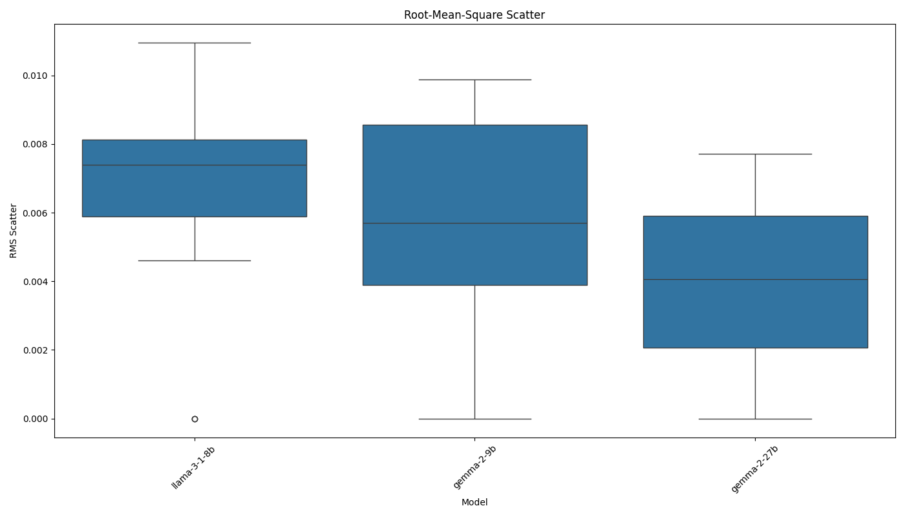

# AI Model Consistency Experiment Report

Analysis generated on: 2025-03-26 14:56:59

## Experiment Overview

- Models tested: llama-3-1-8b, gemma-2-9b, gemma-2-27b
- Number of questions: 20
- Results file: ./results/raw_results_20250326_145658.pkl

## Model Pair Distances

Average Euclidean distances between model mean embeddings across all questions:

| model1       | model2      |   distance |
|:-------------|:------------|-----------:|
| gemma-2-9b   | gemma-2-27b |     0.1792 |
| llama-3-1-8b | gemma-2-27b |     0.4065 |
| llama-3-1-8b | gemma-2-9b  |     0.4182 |

## Consistency Metrics

### Mean Standard Deviation

Average of standard deviations across all embedding dimensions:

| model        |   mean_stddev |
|:-------------|--------------:|
| gemma-2-27b  |        0.0035 |
| gemma-2-9b   |        0.0051 |
| llama-3-1-8b |        0.0060 |

### Root-Mean-Square Scatter

Root-mean-square of standard deviations across all embedding dimensions:

| model        |   rms_scatter |
|:-------------|--------------:|
| gemma-2-27b  |        0.0039 |
| gemma-2-9b   |        0.0057 |
| llama-3-1-8b |        0.0065 |

## Visualizations

### Distance Matrix

### Mean Standard Deviation

### Root-Mean-Square Scatter

## Per-Question Analysis

### Q1

#### Model Distances

| question   | model1       | model2      |   distance |
|:-----------|:-------------|:------------|-----------:|
| Q1         | llama-3-1-8b | gemma-2-9b  |     0.4229 |
| Q1         | llama-3-1-8b | gemma-2-27b |     0.3766 |
| Q1         | gemma-2-9b   | gemma-2-27b |     0.2100 |

#### Consistency Metrics

| model        | question   |   mean_stddev |   rms_scatter |   zero_std_dims | identical_responses   |
|:-------------|:-----------|--------------:|--------------:|----------------:|:----------------------|
| llama-3-1-8b | Q1         |        0.0070 |        0.0076 |               0 | False                 |
| gemma-2-9b   | Q1         |        0.0033 |        0.0036 |               0 | False                 |
| gemma-2-27b  | Q1         |        0.0045 |        0.0050 |               0 | False                 |

### Q2

#### Model Distances

| question   | model1       | model2      |   distance |
|:-----------|:-------------|:------------|-----------:|
| Q2         | llama-3-1-8b | gemma-2-9b  |     0.4189 |
| Q2         | llama-3-1-8b | gemma-2-27b |     0.4328 |
| Q2         | gemma-2-9b   | gemma-2-27b |     0.1628 |

#### Consistency Metrics

| model        | question   |   mean_stddev |   rms_scatter |   zero_std_dims | identical_responses   |
|:-------------|:-----------|--------------:|--------------:|----------------:|:----------------------|
| llama-3-1-8b | Q2         |        0.0082 |        0.0088 |               0 | False                 |
| gemma-2-9b   | Q2         |        0.0080 |        0.0092 |               0 | False                 |
| gemma-2-27b  | Q2         |        0.0032 |        0.0040 |               0 | False                 |

### Q3

#### Model Distances

| question   | model1       | model2      |   distance |
|:-----------|:-------------|:------------|-----------:|
| Q3         | llama-3-1-8b | gemma-2-9b  |     0.3257 |
| Q3         | llama-3-1-8b | gemma-2-27b |     0.3302 |
| Q3         | gemma-2-9b   | gemma-2-27b |     0.0254 |

#### Consistency Metrics

| model        | question   |   mean_stddev |   rms_scatter |   zero_std_dims | identical_responses   |
|:-------------|:-----------|--------------:|--------------:|----------------:|:----------------------|
| llama-3-1-8b | Q3         |        0.0000 |        0.0000 |             289 | True                  |
| gemma-2-9b   | Q3         |        0.0029 |        0.0038 |               0 | False                 |
| gemma-2-27b  | Q3         |        0.0016 |        0.0021 |               0 | False                 |

### Q4

#### Model Distances

| question   | model1       | model2      |   distance |
|:-----------|:-------------|:------------|-----------:|
| Q4         | llama-3-1-8b | gemma-2-9b  |     0.3813 |
| Q4         | llama-3-1-8b | gemma-2-27b |     0.4178 |
| Q4         | gemma-2-9b   | gemma-2-27b |     0.2062 |

#### Consistency Metrics

| model        | question   |   mean_stddev |   rms_scatter |   zero_std_dims | identical_responses   |
|:-------------|:-----------|--------------:|--------------:|----------------:|:----------------------|
| llama-3-1-8b | Q4         |        0.0066 |        0.0072 |               0 | False                 |
| gemma-2-9b   | Q4         |        0.0036 |        0.0039 |               0 | False                 |
| gemma-2-27b  | Q4         |        0.0049 |        0.0057 |               0 | False                 |

### Q5

#### Model Distances

| question   | model1       | model2      |   distance |
|:-----------|:-------------|:------------|-----------:|
| Q5         | llama-3-1-8b | gemma-2-9b  |     0.4764 |
| Q5         | llama-3-1-8b | gemma-2-27b |     0.3493 |
| Q5         | gemma-2-9b   | gemma-2-27b |     0.3194 |

#### Consistency Metrics

| model        | question   |   mean_stddev |   rms_scatter |   zero_std_dims | identical_responses   |
|:-------------|:-----------|--------------:|--------------:|----------------:|:----------------------|
| llama-3-1-8b | Q5         |        0.0058 |        0.0066 |               0 | False                 |
| gemma-2-9b   | Q5         |        0.0086 |        0.0099 |               0 | False                 |
| gemma-2-27b  | Q5         |        0.0029 |        0.0037 |               0 | False                 |

### Q6

#### Model Distances

| question   | model1       | model2      |   distance |
|:-----------|:-------------|:------------|-----------:|
| Q6         | llama-3-1-8b | gemma-2-9b  |     0.4490 |
| Q6         | llama-3-1-8b | gemma-2-27b |     0.4837 |
| Q6         | gemma-2-9b   | gemma-2-27b |     0.1782 |

#### Consistency Metrics

| model        | question   |   mean_stddev |   rms_scatter |   zero_std_dims | identical_responses   |
|:-------------|:-----------|--------------:|--------------:|----------------:|:----------------------|
| llama-3-1-8b | Q6         |        0.0071 |        0.0078 |               0 | False                 |
| gemma-2-9b   | Q6         |        0.0086 |        0.0097 |               0 | False                 |
| gemma-2-27b  | Q6         |        0.0035 |        0.0043 |               0 | False                 |

### Q7

#### Model Distances

| question   | model1       | model2      |   distance |
|:-----------|:-------------|:------------|-----------:|
| Q7         | llama-3-1-8b | gemma-2-9b  |     0.6524 |
| Q7         | llama-3-1-8b | gemma-2-27b |     0.6305 |
| Q7         | gemma-2-9b   | gemma-2-27b |     0.0488 |

#### Consistency Metrics

| model        | question   |   mean_stddev |   rms_scatter |   zero_std_dims | identical_responses   |
|:-------------|:-----------|--------------:|--------------:|----------------:|:----------------------|
| llama-3-1-8b | Q7         |        0.0088 |        0.0092 |               0 | False                 |
| gemma-2-9b   | Q7         |        0.0035 |        0.0042 |               0 | False                 |
| gemma-2-27b  | Q7         |        0.0032 |        0.0038 |               0 | False                 |

### Q8

#### Model Distances

| question   | model1       | model2      |   distance |
|:-----------|:-------------|:------------|-----------:|
| Q8         | llama-3-1-8b | gemma-2-9b  |     0.3625 |
| Q8         | llama-3-1-8b | gemma-2-27b |     0.3280 |
| Q8         | gemma-2-9b   | gemma-2-27b |     0.1789 |

#### Consistency Metrics

| model        | question   |   mean_stddev |   rms_scatter |   zero_std_dims | identical_responses   |
|:-------------|:-----------|--------------:|--------------:|----------------:|:----------------------|
| llama-3-1-8b | Q8         |        0.0066 |        0.0071 |               0 | False                 |
| gemma-2-9b   | Q8         |        0.0055 |        0.0059 |               0 | False                 |
| gemma-2-27b  | Q8         |        0.0067 |        0.0071 |               0 | False                 |

### Q9

#### Model Distances

| question   | model1       | model2      |   distance |
|:-----------|:-------------|:------------|-----------:|
| Q9         | llama-3-1-8b | gemma-2-9b  |     0.3437 |
| Q9         | llama-3-1-8b | gemma-2-27b |     0.3642 |
| Q9         | gemma-2-9b   | gemma-2-27b |     0.1293 |

#### Consistency Metrics

| model        | question   |   mean_stddev |   rms_scatter |   zero_std_dims | identical_responses   |
|:-------------|:-----------|--------------:|--------------:|----------------:|:----------------------|
| llama-3-1-8b | Q9         |        0.0075 |        0.0080 |               0 | False                 |
| gemma-2-9b   | Q9         |        0.0054 |        0.0059 |               0 | False                 |
| gemma-2-27b  | Q9         |        0.0024 |        0.0030 |               0 | False                 |

### Q10

#### Model Distances

| question   | model1       | model2      |   distance |
|:-----------|:-------------|:------------|-----------:|
| Q10        | llama-3-1-8b | gemma-2-9b  |     0.2666 |
| Q10        | llama-3-1-8b | gemma-2-27b |     0.2723 |
| Q10        | gemma-2-9b   | gemma-2-27b |     0.1900 |

#### Consistency Metrics

| model        | question   |   mean_stddev |   rms_scatter |   zero_std_dims | identical_responses   |
|:-------------|:-----------|--------------:|--------------:|----------------:|:----------------------|
| llama-3-1-8b | Q10        |        0.0042 |        0.0046 |               0 | False                 |
| gemma-2-9b   | Q10        |        0.0000 |        0.0000 |             276 | True                  |
| gemma-2-27b  | Q10        |        0.0016 |        0.0019 |               0 | False                 |

### Q11

#### Model Distances

| question   | model1       | model2      |   distance |
|:-----------|:-------------|:------------|-----------:|
| Q11        | llama-3-1-8b | gemma-2-9b  |     0.3513 |
| Q11        | llama-3-1-8b | gemma-2-27b |     0.3341 |
| Q11        | gemma-2-9b   | gemma-2-27b |     0.2156 |

#### Consistency Metrics

| model        | question   |   mean_stddev |   rms_scatter |   zero_std_dims | identical_responses   |
|:-------------|:-----------|--------------:|--------------:|----------------:|:----------------------|
| llama-3-1-8b | Q11        |        0.0080 |        0.0084 |               0 | False                 |
| gemma-2-9b   | Q11        |        0.0048 |        0.0052 |               0 | False                 |
| gemma-2-27b  | Q11        |        0.0038 |        0.0041 |               0 | False                 |

### Q12

#### Model Distances

| question   | model1       | model2      |   distance |
|:-----------|:-------------|:------------|-----------:|
| Q12        | llama-3-1-8b | gemma-2-9b  |     0.3141 |
| Q12        | llama-3-1-8b | gemma-2-27b |     0.3130 |
| Q12        | gemma-2-9b   | gemma-2-27b |     0.0112 |

#### Consistency Metrics

| model        | question   |   mean_stddev |   rms_scatter |   zero_std_dims | identical_responses   |
|:-------------|:-----------|--------------:|--------------:|----------------:|:----------------------|
| llama-3-1-8b | Q12        |        0.0000 |        0.0000 |             287 | True                  |
| gemma-2-9b   | Q12        |        0.0010 |        0.0014 |               0 | False                 |
| gemma-2-27b  | Q12        |        0.0000 |        0.0000 |             281 | True                  |

### Q13

#### Model Distances

| question   | model1       | model2      |   distance |
|:-----------|:-------------|:------------|-----------:|
| Q13        | llama-3-1-8b | gemma-2-9b  |     0.4385 |
| Q13        | llama-3-1-8b | gemma-2-27b |     0.4620 |
| Q13        | gemma-2-9b   | gemma-2-27b |     0.1678 |

#### Consistency Metrics

| model        | question   |   mean_stddev |   rms_scatter |   zero_std_dims | identical_responses   |
|:-------------|:-----------|--------------:|--------------:|----------------:|:----------------------|
| llama-3-1-8b | Q13        |        0.0094 |        0.0100 |               0 | False                 |
| gemma-2-9b   | Q13        |        0.0085 |        0.0096 |               0 | False                 |
| gemma-2-27b  | Q13        |        0.0044 |        0.0052 |               0 | False                 |

### Q14

#### Model Distances

| question   | model1       | model2      |   distance |
|:-----------|:-------------|:------------|-----------:|
| Q14        | llama-3-1-8b | gemma-2-9b  |     0.2809 |
| Q14        | llama-3-1-8b | gemma-2-27b |     0.2504 |
| Q14        | gemma-2-9b   | gemma-2-27b |     0.1445 |

#### Consistency Metrics

| model        | question   |   mean_stddev |   rms_scatter |   zero_std_dims | identical_responses   |
|:-------------|:-----------|--------------:|--------------:|----------------:|:----------------------|
| llama-3-1-8b | Q14        |        0.0000 |        0.0000 |             279 | True                  |
| gemma-2-9b   | Q14        |        0.0045 |        0.0055 |               0 | False                 |
| gemma-2-27b  | Q14        |        0.0000 |        0.0000 |             293 | True                  |

### Q15

#### Model Distances

| question   | model1       | model2      |   distance |
|:-----------|:-------------|:------------|-----------:|
| Q15        | llama-3-1-8b | gemma-2-9b  |     0.4878 |
| Q15        | llama-3-1-8b | gemma-2-27b |     0.4512 |
| Q15        | gemma-2-9b   | gemma-2-27b |     0.1493 |

#### Consistency Metrics

| model        | question   |   mean_stddev |   rms_scatter |   zero_std_dims | identical_responses   |
|:-------------|:-----------|--------------:|--------------:|----------------:|:----------------------|
| llama-3-1-8b | Q15        |        0.0074 |        0.0080 |               0 | False                 |
| gemma-2-9b   | Q15        |        0.0055 |        0.0061 |               0 | False                 |
| gemma-2-27b  | Q15        |        0.0065 |        0.0070 |               0 | False                 |

### Q16

#### Model Distances

| question   | model1       | model2      |   distance |
|:-----------|:-------------|:------------|-----------:|
| Q16        | llama-3-1-8b | gemma-2-9b  |     0.2995 |
| Q16        | llama-3-1-8b | gemma-2-27b |     0.3603 |
| Q16        | gemma-2-9b   | gemma-2-27b |     0.2089 |

#### Consistency Metrics

| model        | question   |   mean_stddev |   rms_scatter |   zero_std_dims | identical_responses   |
|:-------------|:-----------|--------------:|--------------:|----------------:|:----------------------|
| llama-3-1-8b | Q16        |        0.0071 |        0.0077 |               0 | False                 |
| gemma-2-9b   | Q16        |        0.0047 |        0.0053 |               0 | False                 |
| gemma-2-27b  | Q16        |        0.0061 |        0.0064 |               0 | False                 |

### Q17

#### Model Distances

| question   | model1       | model2      |   distance |
|:-----------|:-------------|:------------|-----------:|
| Q17        | llama-3-1-8b | gemma-2-9b  |     0.5175 |
| Q17        | llama-3-1-8b | gemma-2-27b |     0.3815 |
| Q17        | gemma-2-9b   | gemma-2-27b |     0.4749 |

#### Consistency Metrics

| model        | question   |   mean_stddev |   rms_scatter |   zero_std_dims | identical_responses   |
|:-------------|:-----------|--------------:|--------------:|----------------:|:----------------------|
| llama-3-1-8b | Q17        |        0.0064 |        0.0071 |               0 | False                 |
| gemma-2-9b   | Q17        |        0.0073 |        0.0079 |               0 | False                 |
| gemma-2-27b  | Q17        |        0.0000 |        0.0000 |             260 | True                  |

### Q18

#### Model Distances

| question   | model1       | model2      |   distance |
|:-----------|:-------------|:------------|-----------:|
| Q18        | llama-3-1-8b | gemma-2-9b  |     0.5014 |
| Q18        | llama-3-1-8b | gemma-2-27b |     0.4903 |
| Q18        | gemma-2-9b   | gemma-2-27b |     0.2300 |

#### Consistency Metrics

| model        | question   |   mean_stddev |   rms_scatter |   zero_std_dims | identical_responses   |
|:-------------|:-----------|--------------:|--------------:|----------------:|:----------------------|
| llama-3-1-8b | Q18        |        0.0052 |        0.0055 |               0 | False                 |
| gemma-2-9b   | Q18        |        0.0080 |        0.0086 |               0 | False                 |
| gemma-2-27b  | Q18        |        0.0068 |        0.0077 |               0 | False                 |

### Q19

#### Model Distances

| question   | model1       | model2      |   distance |
|:-----------|:-------------|:------------|-----------:|
| Q19        | llama-3-1-8b | gemma-2-9b  |     0.4603 |
| Q19        | llama-3-1-8b | gemma-2-27b |     0.4904 |
| Q19        | gemma-2-9b   | gemma-2-27b |     0.3233 |

#### Consistency Metrics

| model        | question   |   mean_stddev |   rms_scatter |   zero_std_dims | identical_responses   |
|:-------------|:-----------|--------------:|--------------:|----------------:|:----------------------|
| llama-3-1-8b | Q19        |        0.0098 |        0.0109 |               0 | False                 |
| gemma-2-9b   | Q19        |        0.0079 |        0.0086 |               0 | False                 |
| gemma-2-27b  | Q19        |        0.0061 |        0.0065 |               0 | False                 |

### Q20

#### Model Distances

| question   | model1       | model2      |   distance |
|:-----------|:-------------|:------------|-----------:|
| Q20        | llama-3-1-8b | gemma-2-9b  |     0.6132 |
| Q20        | llama-3-1-8b | gemma-2-27b |     0.6124 |
| Q20        | gemma-2-9b   | gemma-2-27b |     0.0093 |

#### Consistency Metrics

| model        | question   |   mean_stddev |   rms_scatter |   zero_std_dims | identical_responses   |
|:-------------|:-----------|--------------:|--------------:|----------------:|:----------------------|
| llama-3-1-8b | Q20        |        0.0056 |        0.0060 |               0 | False                 |
| gemma-2-9b   | Q20        |        0.0000 |        0.0000 |             268 | True                  |
| gemma-2-27b  | Q20        |        0.0009 |        0.0012 |               0 | False                 |

